<head>
  
  
</head>

---

##### Description

  In this project, we learned to develop and apply an astronomical data reduction and analysis pipeline for both imaging and long-slit spectroscopic observations, using actual CCD data from the ground-based Nordic Optical Telescope. This project was completed as a series of group exercises during the course <a href="https://kurser.ku.dk/course/nfyk12009u">Astronomical Data Processing</a>, run by Prof. Lise Christensen (University of Copenhagen) between September and November of 2024.

---

##### Analysis of imaging data

  In analysing astronomical data, one must take into account the various sources of noise that are introduced into the image, and in removing them, one can produce a usable science image. We demonstrate this through working with images taken of the M67 stellar cluster by the ESO 3.6m telescope in La Silla, Chile. Images are recorded in three separate passbands: B (blue), V (visual), and R (red).

  Three types of calibration frames are required in order to reduce CCD data:

  - <b>Bias frames</b>: A measure of the noise introduced when the CCD reads out the image data. This noise level can be quantified by taking an image where the CCD exposure time is extremely short (e.g. 0.001 seconds).
  - <b>Flat frames</b>: Consists of exposures taken on a uniformly lit object. These are used to correct for optical imperfections in the raw exposures such as dust spots, as well as any pixel gradients or vignetting that occur as a result of non-uniformities in the CCD sensitivity. 
  - <b>Dark frames</b>: Relates to the CCD's internal thermal noise as electrons are released within the silicon material of the CCD during long exposures. Closing the shutter of the telescope but exposing the CCD for the same length of time as the science observation allows us to quantify this noise.

  Typically, multiple calibration images are taken before being combined into a master frame.

  Processing a science image consists of subtracting the thermal and read-out noise (dark and bias) from the original image, and then dividing by the normalised, bias-subtracted flat. Normalising the flat after having subtracted the bias means that when the science images are divided, you are correcting for intrinsic differences in brightness, but will not largely affect the values in the science image. As an equation, this looks like: 

$$ 
  \textbf{Processed Science Image} = \frac{\textbf{Science} - \textbf{Dark} - \textbf{Bias}}{\text{Normalised}(\textbf{Flat} - \textbf{Bias})}
$$

  We perform the above transformation using <a href="https://ccdproc.readthedocs.io/en/latest/">`ccdproc`</a>, a Python package to do CCD data reduction, producing our final science images.

  <figure style="width:100%; margin:0 auto;">    
    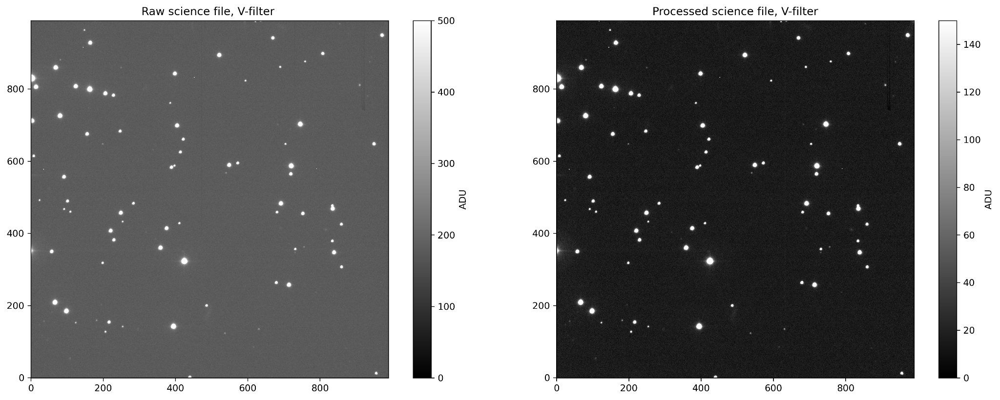
    <figcaption style="text-align:center; font-weight:normal; font-size:smaller">Comparison of raw image versus processed science image.</figcaption>
  </figure>

  We observe that the overall pixel values of the raw image are higher, with a mean background value of 150-200 ADU from visual inspection, while the processed science image has a background value in the range of 0-20 ADU. The decrease in the spread of pixel values indicates that the reduction process has effectively reduced the presence of electronic or thermal noise injected into the frame, as well as underlying optical imperfections. The mean pixel value in the processed image (taken in a background region with no stars) is much lower, meaning that our image has been effectively reduced to only measure the fluxes of stars in the frame.

---

##### Aperture photometry

  ###### Photometric standard stars

  In this section, our goal is to determine the instrumental magnitudes (and their respective errors) of the photometric-standard stars through the method of aperture photometry. This entails the calculation of the total flux in a circular region around a star, which we use to establish a calibration factor to correct both our initial zero-point value and colour correction for the telescope, for use in our later calibration.

  The data used for this activity is the same as in the imaging section. We refer to Landolt (1992), which provides us with a table of known photometric magnitudes for five standard stars (PG 1323-086, A, B, C, D) within the image.

  We determine the pixel positions of three of the five stars in the image and compute a Gaussian profile fit onto the star, determining the full-width half-maximum (FWHM) of the star, assuming that its point-spread function (PSF) is approximately circular. The FWHM gives us an indication of the spread of the light from the star, and therefore plays a part in our photometry in defining the appropriate aperture size within which all the light from the star is collected. 
  
  The FWHM can also be an indicator of the blurriness of the image, as a higher FWHM may be the result of seeing effects, where the atmosphere smears light into a larger beam. We calculate seeing by multiplying the FWHM by the pixel scale of the image, finding it to be within the range of 1.6--1.7 arcseconds, indicating that the atmosphere was somewhat clear and we can resolve most details of the stars within the image.

  Given our FWHM for the three standard stars, we construct apertures of 3 FWHM in diameter, recording the flux within as the sum of pixels contained in the aperture. We determine corresponding background values by measuring the background flux in an annuli of 1 FWHM around the central aperture. From here, we determine the instrumental count rate of each star, subtracting the background flux from the aperture flux, and dividing by the exposure time--Increased exposure time will lead to an increase in instrument counts, so we want our instrumental flux to be time-independent. Furthermore, by assuming an instrumental zero-point, we can convert our flux count into a magnitude, using the equation:

  $$
    m = -2.5 \log(F_{\text{star}}) + \text{ZP}
  $$

  However, our assumptions of the zero-point are only assumptions, and so by comparing to the photometric magnitudes provided by Landolt (1992), we can determine the exact zero-point for each star and filter, which will provide corrected object magnitudes.

  ###### Colour-magnitude diagram

  We now make use of our previous methods, applying them to the rest of the sources in the image, in order to determine their magnitudes and colours. We make use of `DAOStarFinder`, detecting sources in the image exceeding 10$\sigma$, given an approximate FWHM size, and with a peak flux less than 60,000 ADU (so as to not count over-exposed or very bright sources).

  <figure style="width:80%; margin:0 auto;">    
    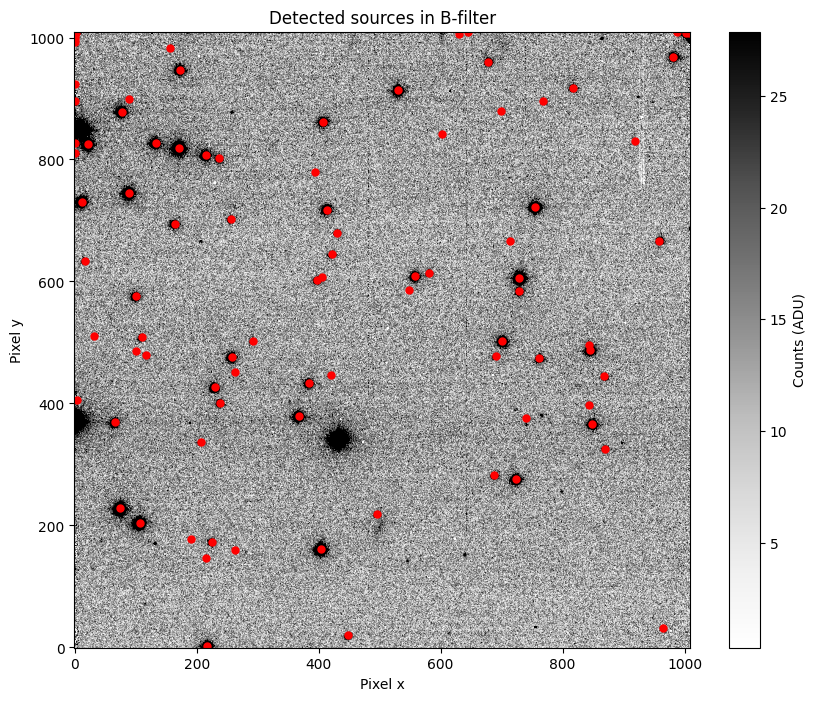
    <figcaption style="text-align:center; font-weight:normal; font-size:smaller">B-filter image with sources detected.</figcaption>
  </figure>

  We extract sources that are able to be identified across the B, V, and R filter images, by removing sources that are mismatched in distance from each other by 5 pixels after looping through all sources in all images. This extraction provides a list of 61 sources, for which we calculate magnitudes using the same process as described above.

  The B, V, and R colours are calculated by accounting for atmospheric extinction, involving a calculating of the airmass and magnitudes extracted previously.

  

  <figure style="flex:1; margin:0;">
    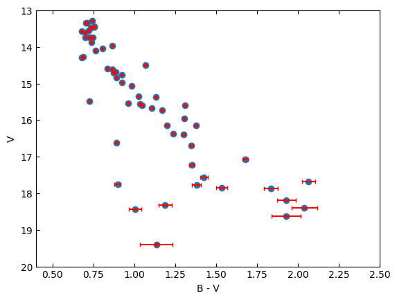
  </figure>
  <figure style="flex:1; margin:0;">
    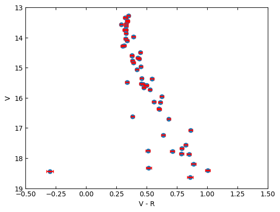
  </figure>

Colour-magnitude diagrams of the 61 extracted sources.

 

Comparing to the colour-magnitude diagram from Gilliland et al. (1991):

<figure style="width:90%; margin:0 auto;">    
  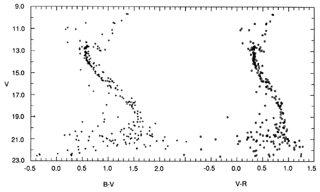
  <figcaption style="text-align:center; font-weight:normal; font-size:smaller">Colour-magnitude diagram from Gilliland et al. (1991).</figcaption>
</figure>

We see that our extracted magnitudes appear to be consistent to that of Gilliland.

---

##### Spectroscopy

  Here we move over to spectroscopy, where we perform reductions of long-slit spectral data. The processing steps involved are similar to that of imaging data, such as removing instrument effects such as bias and dark noise, and flat-fielding the image to remove optical distortions. Finally, we perform sky-subtraction to remove background contamination. Once completed, we can finally extract spectral information from the isolated observed source. The key difference is the need to map the CCD pixel positions to wavelengths and handling line profiles for physical analysis; Therefore, the use of wavelength calibration and 1D spectral extraction is critical for this process.
  
  The data to be processed was taken by the ALFOSC instrument on the Nordic Optical Telescope (NOT), consisting of two 300-second science exposures of the supernova SN2017eaw and a spectrophotometric standard star BD332642.

  ###### Image processing  
  In processing the long-slit spectral images, we generated master bias and flat frames in the same way we did for imaging data, and apply bias subtraction and flat-fielding to the raw spectral images, using <a href="https://jkrogager.github.io/pynot/">`PyNOT`</a> (designed for handling data observed by the NOT).

  <figure style="width:60%; margin:0 auto;">    
    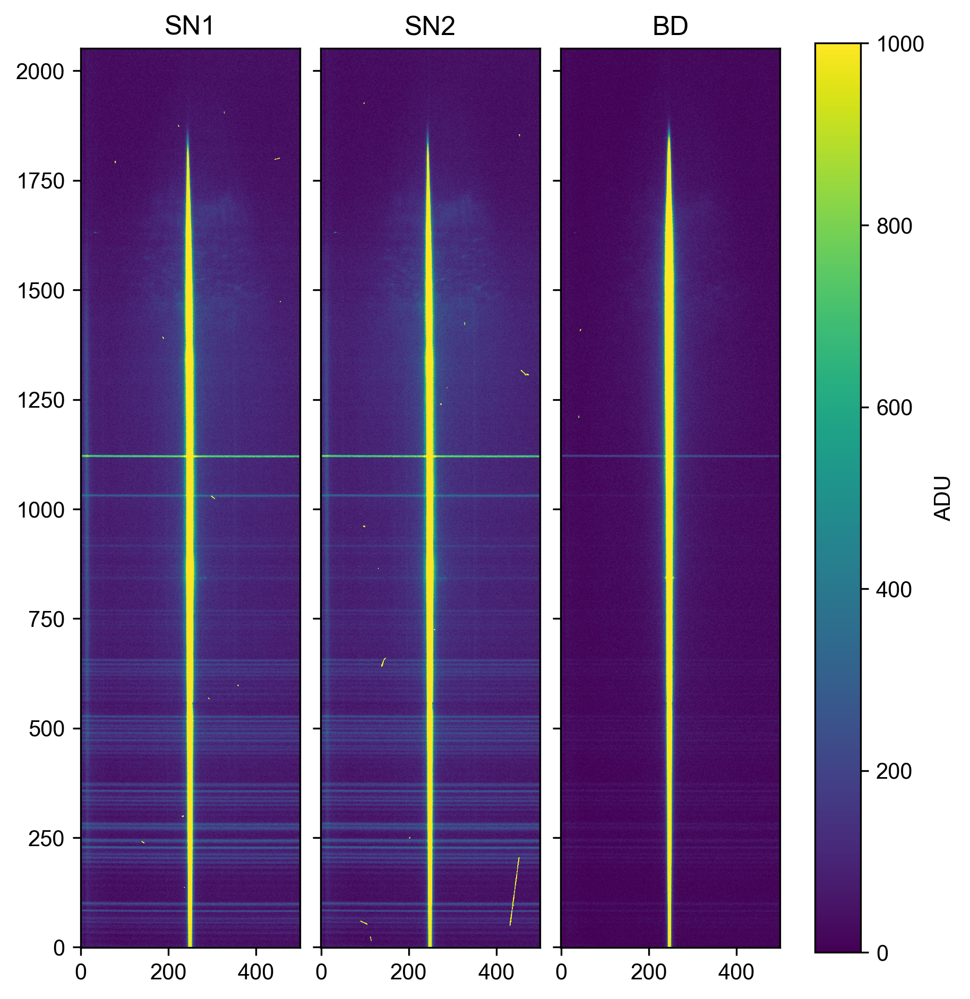
    <figcaption style="text-align:center; font-weight:normal; font-size:smaller">Processed spectra of two supernova images (SN1, SN2) and photometric standard star (BD).</figcaption>
  </figure>

  ###### Wavelength calibration

  We now begin our wavelength calibration, which entails aligning the pixel positions of spectral features onto a reference wavelength scale. We do so by matching features of a standard calibration star to features in our observed spectra. This is achieved through the use of arc lamps, which show emission features at particular wavelengths when heated. Typically, helium-neon or thorium-argon lamps are used in observatories, providing known emission lines which we can map onto our spectra.

  Provided with a reference line list for a helium-neon lamp, we identified lines in each spectra that corresponded to known lines in the list. This allows us to calibrate the observed spectra so that we know on which wavelength scale this has been observed. The best fit between the spectral lines and reference lines is calculated, known as the wavelength solution. In identifying lines, we removed those that negatively affected the fit, so as to find the best wavelength solution.

  This one-dimensional wavelength solution is then applied to the two-dimensional spectral images by means of the function `rectify`. This process ensures a consistent wavelength scale across the spatial axis, effectively removing any curvature in the arc lamp emission lines and background sky lines.

  ###### Sky line subtraction

  We now seek to remove the sky background from spectra, such that we only observe our emitted object. We use the function `auto_fit_background` on one of the processed wavelength-calibrated rectified images:

  <figure style="width:50%; margin:0 auto;">    
    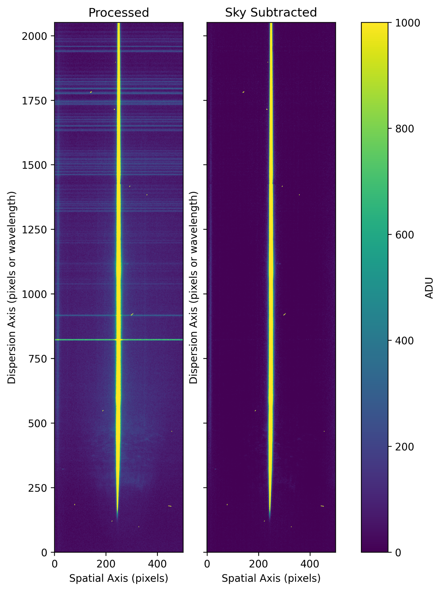
    <figcaption style="text-align:center; font-weight:normal; font-size:smaller">Original processed spectrum vs sky-subtracted spectrum.</figcaption>
  </figure>

  As we can see, the sky lines are effectively removed.

  ###### Extraction of 1D spectra

  In this section, we seek to trace and extract one-dimensional spectra from the two-dimensional detector image. To do this, we use the function `extract` that allows us to specify the centroid of the target on the spectral dispersion axis. This defines the spectra point spread function (SPSF), which is effectively the sum of the science image along the spectral axis. Using either a Moffat or Gaussian profile to fit onto the SPSF, this modelled profile is used to perform a weighted optimal extraction of the spectrum from the detector image. Alternatively, a "tophat" profile simply sums the flux within specified aperture boundaries. The 1D spectra are extracted using this profile:

  <figure style="width:80%; margin:0 auto;">    
    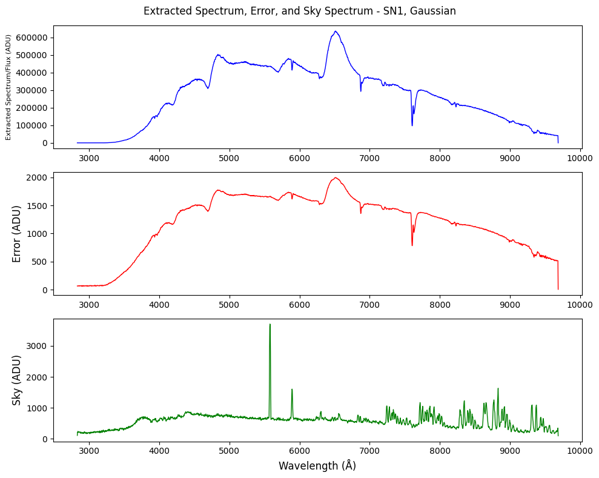
    <figcaption style="text-align:center; font-weight:normal; font-size:smaller">Extracted 1D spectral flux, error, and sky lines.</figcaption>
  </figure>

  We notice the presence of sky lines between 7000Å and 10000Å, which are emission lines from OH in the atmosphere. The strongest line in the centre of the spectrum is the atmosphere O[I] line at 5577Å, also resultant of excited oxygen atoms in the atmosphere.

  ###### Flux calibration

  In order to further analyse the spectra data, we need to make determine the physical flux observed. This is done by deriving an instrumental sensitivity function from our spectrophotometric standard star, whose spectral flux is known in absolute units. The sensitivity function transforms the spectra from units of ADU/pixel to a flux density with a unit of erg/s/cm^2/Å, i.e. transforming from counts to a physical flux. This requires the use of the spectra for our photometric standard star, which we were provided with. The response function is calculated, which considers the match between the spectra of the photometric standard star in units of ADU/pixel and its established real flux in physical units.

  We use the function `flux_calibrate_1d` to calibrate the fluxes. The function requires the response function from previously, and the extracted 1D spectra of the two SN frames (SN1 and SN2). We simultaneously combine the two spectra to achieve a greater signal-to-noise ratio, and display the resultant final spectrum and error.

  <figure style="width:80%; margin:0 auto;">    
    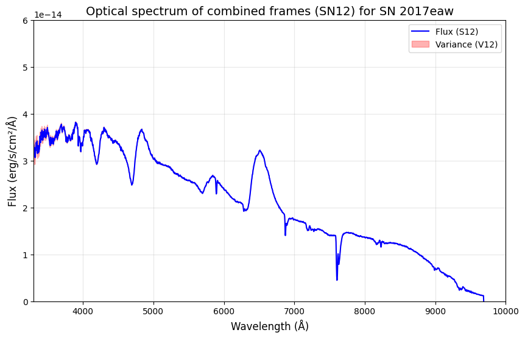
    <figcaption style="text-align:center; font-weight:normal; font-size:smaller">Flux-calibrated 1D spectral flux and error.</figcaption>
  </figure>

  In order to verify that our flux-calibration has yielded an accurate spectrum, we found spectra measurements from Van Dyk et al. (2019) containing a series of spectra measurements for SN 2017eaw taken between 17/05/2017 and 06/09/2018. We choose to plot the spectral measurements taken on 21/05/2017 as this was the closest measurement to that of when our data was observed.

  <figure style="width:80%; margin:0 auto;">    
    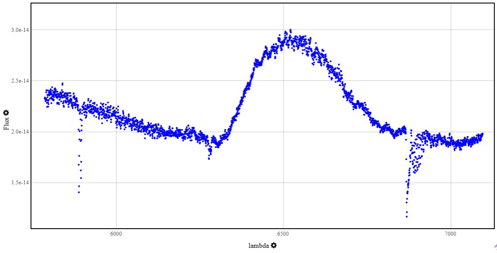
    <figcaption style="text-align:center; font-weight:normal; font-size:smaller">Spectrum measurement of SN2017eaw taken on 21/05/2017. Data from Van Dyk, et al. (2019).</figcaption>
  </figure>

  Plotting our flux-calibrated spectrum in the same range as the data available (5800 to 7100 Å) to compare:

  <figure style="width:80%; margin:0 auto;">    
    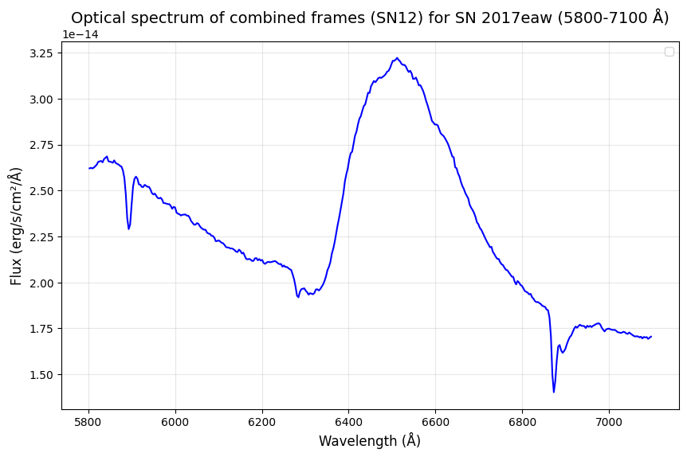
    <figcaption style="text-align:center; font-weight:normal; font-size:smaller">Flux-calibrated spectrum of SN 2017eaw, within the wavelength range of 5800 to 7100 Å.</figcaption>
  </figure>

  We observe the presence of three absorption lines at 5890Å, 6280Å and 6880Å, all of which are also visible in our flux-calibrated spectra. We also observe a distinguishable peak at 6500Å which is present in both images. At this stage, the data is ready to be used for further scientific exploration, such as further analysing spectral features or determining physical properties of the source.

