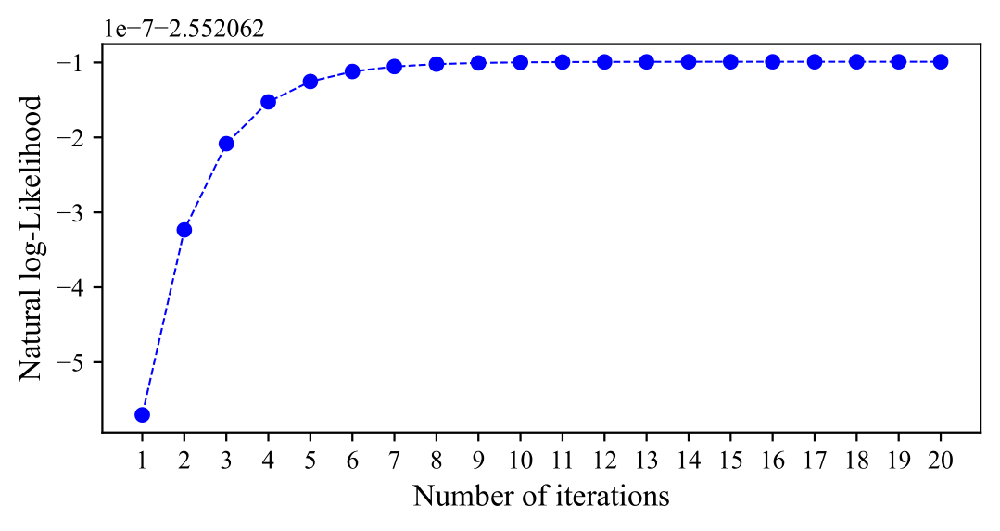
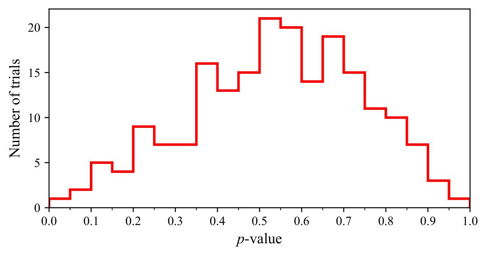
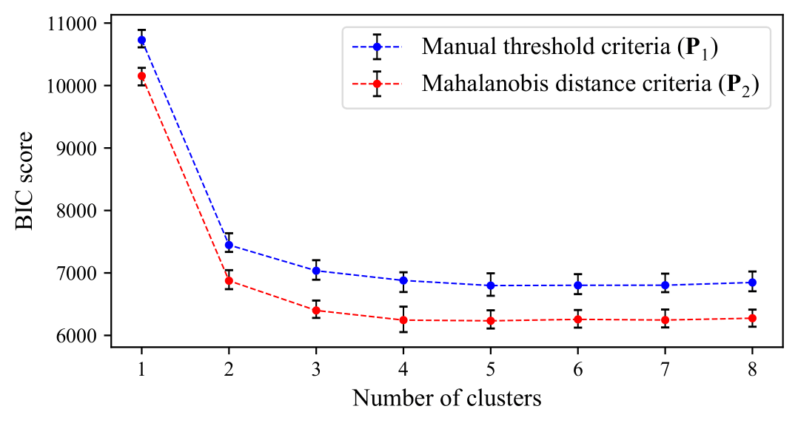
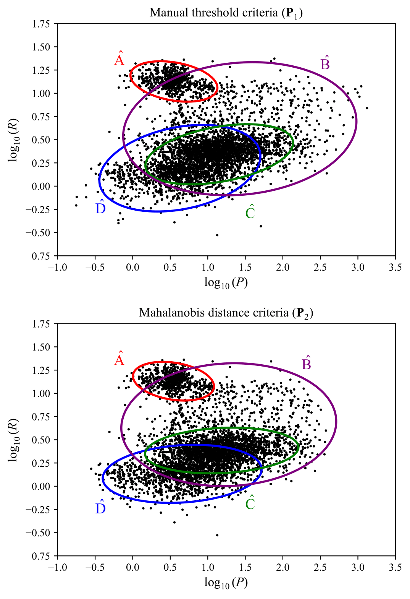

<head>
  
  
</head>

---

##### Project description

  This project looks at Gaussian mixture models, discussing their effectiveness at recovering clusters in test data, and applying them to exoplanet parameter data.</a>. This was done as the final project for the course <a href="https://kurser.ku.dk/course/nfyk15002u">Advanced Methods in Applied Statistics</a>, run by Dr. Jason Koskinen (University of Copenhagen) between February and April of 2025.

---

##### Introduction

  In machine learning and applied statistics, clustering methods are used to divide a set of unlabelled data points into clusters, such that the data points within a cluster are more similar to each other than to those in other clusters. Gaussian mixture models (GMMs) are an example of a clustering method, which attempts to cluster data into a number of Gaussian distributions. In this project, we shortly outline the mathematical framework of GMMs, then test how effective they are at recovering clusters in synthetic data sourced from a mixed Gaussian distribution. Afterwards, we apply these models to exoplanet period-radius data, and use a Kolmogorov-Smirnov test to determine how well these recovered clusters align with a Gaussian mixture.

---

##### Defining Gaussian mixture models

The Gaussian mixture model (GMM) is a probabilistic clustering technique, used to identify a set of $K$ clusters that best represent some observed distribution in data with $M$ parameters, assuming that each cluster consists of a multivariate Gaussian distribution (each cluster has its own mean and variance). This technique is categorized as an unsupervised learning method, as clusters are identified without requiring prior information about the data points’ classifications.

The probability distribution $P(\boldsymbol{x}_n)$ of the data $\boldsymbol{x}$ (consisting of $N$ data points) can be expressed as the weighted sum of the $K$ Gaussian clusters:

$$
P(\boldsymbol{x}_n) = \sum _{k=1}^K P(\boldsymbol{x}_n|\boldsymbol{\mu}_k, \boldsymbol{\Sigma}_k) P(k)
$$

where $k = 1 \dots K$, $P(k)$ is the mixture weight (effectively a vector of the probability that each cluster would contain the point), and $\boldsymbol{\mu}_k$ and $\boldsymbol{\Sigma}_k$ are the mean and variances/covariance matrices of the $k$-th Gaussian cluster respectively. It follows that the density distribution of an individual Gaussian cluster is:

$$
P(\boldsymbol{x}|\boldsymbol{\mu}_k,\boldsymbol{\Sigma}_k) =
\frac{\exp\Big[-\frac{1}{2}(\boldsymbol{x}-\boldsymbol{\mu}_k) \cdot \boldsymbol{\Sigma}_k^{-1} \cdot (\boldsymbol{x}-\boldsymbol{\mu}_k)\Big]}{(2\pi)^{M/2} \sqrt{|\boldsymbol{\Sigma}_k|}}
$$

Using Bayes' theorem, the posterior probability (responsibility matrix) is given by:

$$
P(k|\boldsymbol{x}_n) = \frac{P(\boldsymbol{x}_n|\boldsymbol{\mu}_k,\boldsymbol{\Sigma}_k) P(k)}{P(\boldsymbol{x}_n)}
$$

The likelihood $\Lambda$ describing the product of the probabilities of finding a point at each observed position is:

$$
\Lambda = \prod_{i=1}^N P(\boldsymbol{x}_i)
$$

The optimal values for the parameters are found by maximising the likelihood $\Lambda$, which is akin to maximising the posterior probability of the parameters. The parameters $\boldsymbol{\mu}_k$, $\boldsymbol{\Sigma}_k$, and $P(k)$ can be determined from the data by means of the Expectation-Maximisation (EM) algorithm:

1. Initial values for $\boldsymbol{\mu}_k$, $\boldsymbol{\Sigma}_k$ and $P(k)$ are assigned based on a chosen initialization method, such as random data point selection or k-means clustering.
2. Expectation step (E-step): $P(\boldsymbol{x})$ and $P(\boldsymbol{x}|\boldsymbol{\mu}_k, \boldsymbol{\Sigma}_k)$ are calculated.
3. Maximisation step (M-step): Model parameters are updated using:

$$
\boldsymbol{\mu}_{k,\text{new}} = \frac{\sum _{i=1}^N \boldsymbol{x}_i P(k|\boldsymbol{x}_i)}{\sum _{i=1}^N P(k|\boldsymbol{x}_i)}
$$

$$
\boldsymbol{\Sigma}_{k,\text{new}} = \frac{\sum _{i=1}^N (\boldsymbol{x}_i - \boldsymbol{\mu}_k) \otimes (\boldsymbol{x}_i - \boldsymbol{\mu}_k) P(k|\boldsymbol{x}_i)}{\sum _{i=1}^N P(k|\boldsymbol{x}_i)}
$$

$$
P(k)_{\text{new}} = \frac{1}{N} \sum _{i=1}^N P(k|\boldsymbol{x}_i)
$$

4. The EM steps are repeated until the total likelihood $\Lambda$ converges.

With these steps in mind, we have an idea of how the GMM should be able to identify clusters in data. 

---

##### Comparing distributions with K-S testing

  In order to determine whether the exoplanet data can be effectively describes as mixed Gaussian clusters, we require a method to compare the data's distribution to that of the distribution formed by the recovered Gaussian clusters. To do so, we make use of the Kolgomorov-Smirnov (K-S) test, which is a non-parametric statistical test designed to compare a sample dataset with a reference probability distribution (one-sample test) or to $m$ compare two independent sample datasets (two-sample test). It evaluates whether the distributions differ significantly by quantifying the maximum deviation between their cumulative distribution functions. The test in its one-dimensional formulation is commonly used for datasets characterized by a single variable. However, many datasets involve multi-dimensional parameter spaces, necessitating an extension of the K-S test to higher dimensions.

  The two-dimensional K-S test generalizes the one-dimensional method to pairs of values, $(x,y)$, which describe each data point. Unlike in one dimension, it is not trivial to define a unique cumulative probability distribution in two dimensions (Fasano & Franceschini, 1987). To address this, the test divides the plane for each data point $(x_i,y_i)$ into four quadrants: $(x>x_i, y>y_i)$, $(x>x_i, y<y_i)$, $(x<x_i, y>y_i)$ and $(x<x_i, y<y_i)$. For each quadrant, the integrated probability (i.e. the fraction of data points contained within the quadrant) is computed, and the differences in these integrated probabilities between the two distributions are calculated. The K-S test statistic $\mathcal{D}$ is determined to be the largest absolute difference in corresponding integrated probabilities, ranging over all data points and their respective quadrants (<a target="_blank" rel="noopener noreferrer" href="https://academic.oup.com/mnras/article/202/3/615/967854?login=false">Peacock, 1983</a>).

  <figure style="width:80%; margin:0 auto;">
    
    <figcaption style="text-align:center; font-weight:normal"><b>Figure 1:</b> Example of 2D K-S test. Values in corners correspond to fraction of points from respective datasets within quadrant, i.e. (Triangle | Square).</figcaption>
  </figure>

  Figure 1 shows a visualization of the quadrants for comparing two 2D data distributions made of 65 triangles and 35 squares. The dotted lines are centered on the triangle data point that maximizes the $\mathcal{D}$ statistic, with the maximum occurring in the upper-left quadrant. This quadrant contains 0.12 of all triangles and 0.56 of all squares, giving a $\mathcal{D}$ statistic value of 0.44. The $p$-value associated with the $\mathcal{D}$ statistic is then evaluated using the Kolmogorov probability distribution. 

  In applying the K-S test to data, the null hypothesis assumes the data comes from a specific distribution. However, when distribution parameters are estimated from the data (e.g., in a GMM), this creates a dependency between the data and the parameters, leading to a biased $p$-value. To correct for this, a bootstrap test is recommended, where the K-S test is performed on datasets formed by resampling the data, to build an empirical distribution of $p$-values for a more reliable estimate of the null hypothesis and its significance.

---

##### Validation on synthetic data

  To test the GMM, we generate synthetic data for three multivariate normal distributions, each with its own mean and covariance matrix, totaling 2,000 points.

  <figure style="width:80%; margin:0 auto;">
    
    <figcaption style="text-align:center; font-weight:normal"><b>Figure 2:</b> Synthetic data generated from a GMM with 3 clusters.</figcaption>
  </figure>

  

  
Show code for this plot

  

  import numpy as np
  import matplotlib.pyplot as plt
  import matplotlib.ticker as ticker

  np.random.seed(107)

  # Define 3 gaussian clusters then stack all points together
  means = [
      [2, 3],
      [5, 4],
      [7, 3]
  ]

  covariances = [
      [[0.25, 0.125], [0.125, 0.5]],
      [[0.25, -0.075], [-0.075, 0.25]],
      [[0.25, 0], [0, 0.25]]
  ]

  colors = ['red', 'blue', 'green']
  num_points = [600, 400, 1000]

  points = []
  labels = []
  point_colors = []

  for mean, cov, n, color in zip(means, covariances, num_points, colors):
      data = np.random.multivariate_normal(mean, cov, n)
      points.append(data)
      labels.extend([color] * n)
      point_colors.extend([color] * n)

  all_points = np.vstack(points)

  # Plot all distributions on the same graph
  fig, ax = plt.subplots(1, 1, figsize=(5.5, 4))

  cluster_labels = ['A', 'B', 'C']

  for data, color, label in zip(points, colors, cluster_labels):
      ax.scatter(data[:, 0], data[:, 1], color=color, s=4, alpha=1, label=f'Cluster {label}')

  ax.set_xlabel(r"$x$")
  ax.set_ylabel(r"$y$")
  ax.set_xlim(0, 9)
  ax.set_ylim(0, 6)
  ax.yaxis.set_major_locator(ticker.MultipleLocator(1))
  ax.xaxis.set_major_locator(ticker.MultipleLocator(1))
  ax.legend()

  fig.tight_layout()
  plt.show()

  

  
 

  Figure 2 shows the plotted synthetic data. We utilize the GMM implementation from the Python package <a href="https://scikit-learn.org/stable/modules/mixture.html">`scikit-learn`</a>, initialising the cluster parameters using k-means clustering. Additionally, we choose a covariance structure where each cluster is allowed its own general covariance matrix, which enables each cluster to have distinct shapes, orientations, and variances. For the GMM, 100 iterations of the EM algorithm are performed, or until convergence is achieved. The convergence criterion is monitored and reported by the model. 

  <figure style="width:80%; margin:0 auto;">
      
      <figcaption style="text-align:center; font-weight:normal"><b>Figure 3:</b> Natural log likelihood at each iteration step of the EM algorithm in an example application of the GMM to the data shown in Figure 2.</figcaption>
  </figure>

  Figure 3 shows an example plot of the natural log likelihood convergence through the EM-algorithm. It can be seen that model convergence is achieved after ~10 iterations of the EM algorithm, as the natural log likelihood does not increase significantly with further iterations. To select the best model, the GMM is refitted 100 times, and the parameters of the model with the highest likelihood given the data are stored.   

  Applying the GMM to the synthetic data, we can display the 1$\sigma$, 2$\sigma$, and 3$\sigma$ confidence ellipsoids of the Gaussian components on top of the data.

  <figure style="width:80%; margin:0 auto;">
    
    <figcaption style="text-align:center; font-weight:normal"><b>Figure 4:</b> GMM clustering of synthetic Gaussian-distributed data.</figcaption>
  </figure>

  

  
Show code for this plot

  

  from matplotlib.patches import Ellipse
  from sklearn.mixture import GaussianMixture
  from scipy.stats import chi2
  import time

  # Define a function that will return the GMM and the labels predicted for a set of data
  def gaussian_mixture_procedure(data, n_clusters, n_init, max_iter, message=True):
      gmm = GaussianMixture(n_components=n_clusters, covariance_type='full', n_init=n_init, init_params='kmeans', max_iter=max_iter)
      gmm.fit(data)
      labels = gmm.predict(data)

      return gmm, labels

  # Function for plotting ellipses of clusters
  def plot_gmm_contours(gmm, X_log, ax, conf, lw):
      colors = ['red', 'blue', 'green', 'purple', 'orange']
      
      # Sort GMM components by the x-value of the means, ensuring constant ellipse ordering
      sorted_indices = np.argsort(gmm.means_[:, 0])
      sorted_means = gmm.means_[sorted_indices]
      sorted_covariances = gmm.covariances_[sorted_indices]
      sorted_weights = gmm.weights_[sorted_indices]
      
      # Loop through each sorted cluster
      for i, (mean, covar, weight, label) in enumerate(zip(sorted_means, sorted_covariances, sorted_weights, cluster_labels)):
          eigenvalues, eigenvectors = np.linalg.eigh(covar)
          angle = np.degrees(np.arctan2(*eigenvectors[:, 0][::-1]))
          
          v = np.sqrt(chi2.ppf(conf, 2))
          width, height = 2 * v * np.sqrt(eigenvalues)

          # Plot ellipse per cluster
          ellipse = Ellipse(
              mean, width, height,
              angle=angle,
              edgecolor=colors[i % len(colors)], 
              facecolor='none',
              linewidth=lw,
              # label=fr"Cluster {label}$"
          )
          ax.add_patch(ellipse)

  n_clusters = 3
  n_init = 100
  max_iter = 100
  test_gmm, labels = gaussian_mixture_procedure(data=all_points, n_clusters=n_clusters, n_init=n_init, max_iter=max_iter)

  fig, ax = plt.subplots(1, 1, figsize=(5.5, 4))
  scatter = ax.scatter(all_points[:, 0], all_points[:, 1], s=5, alpha=1, edgecolors='none', color='k', cmap='viridis')

  ax.set_xlabel('$x$', fontsize=12)
  ax.set_ylabel('$y$', fontsize=12)

  plot_gmm_contours(test_gmm, data, ax, conf=0.997, lw=1)
  plot_gmm_contours(test_gmm, data, ax, conf=0.955, lw=2)
  plot_gmm_contours(test_gmm, data, ax, conf=0.683, lw=3)

  ax.set_xlabel(r"$x$")
  ax.set_ylabel(r"$y$")

  ax.yaxis.set_major_locator(ticker.MultipleLocator(1))
  ax.xaxis.set_major_locator(ticker.MultipleLocator(1))

  fig.tight_layout()
  plt.show()

  

  
 

  Looking at Figure 4, we can see that the GMM appears to recover the three underlying Gaussian components of the source data. 

  To determine the optimal number of clusters, a balance must be reached between the likelihood of the fitted GMM and the complexity of the model, characterized by the number of clusters. This balance can be quantified using the Bayesian Information Criterion (BIC), which combines the model likelihood with a penalty for increased model complexity:

  

  $$
  \text{BIC} = k\ln(n) - 2\ln(\hat{\mathcal{L}})
  $$

  

  where $k$ represents the number of free parameters in the model, $n$ is the number of data points, and $\hat{\mathcal{L}}$ denotes the maximum likelihood of the model. Among a set of candidate models, the one with the lowest BIC is preferred, as the first term, $k\ln(n)$, penalizes excessive parameter usage, discouraging overfitting. However, despite the BIC favouring more complex models, we prioritize a parsimonious model, opting for a model with fewer components even if it results in a slightly higher BIC. 
  
  <figure style="width:80%; margin:0 auto;">
    
    <figcaption style="text-align:center; font-weight:normal"><b>Figure 5:</b> BIC score with increasing cluster.</figcaption>
  </figure>

  To determine the optimal number of Gaussian components, we calculate the BIC score for the fitted GMM with increasing cluster components, shown in Figure 5. Uncertainties in the BIC are estimated using 100 bootstrap trials, with resampling from the synthetic data distribution. We see that the lowest BIC is reached for a GMM fitted with $k$ = 3 clusters, with no significant improvement observed beyond this. We conclude that the data is best described by three clusters, as anticipated. Table 1 presents the source parameters of the Gaussian data, along with the fitted GMM parameters and their 1$\sigma$ confidence intervals derived from 100 bootstrap trials. All of the source parameters fall within the confidence intervals of the fitted GMM parameters, confirming that the GMM accurately recovers the underlying Gaussian components. 
  
  To assess whether the data follows a multivariate Gaussian distribution, we apply the 2D K-S test using the Python package [ndtest](https://github.com/syrte/ndtest). We conduct a bootstrap analysis with 200 trials, resampling data from the fitted GMMs and calculating the $p$-values for each sample. 

  <figure style="width:80%; margin:0 auto;">
    
    <figcaption style="text-align:center; font-weight:normal"><b>Figure 6:</b> Distribution of $p$-values from 200 bootstrap trials of the 2D K-S test, comparing fitted GMM to synthetic data.</figcaption>
  </figure>

  Figure 6 shows the resulting uniform distribution of $p$-values between 0 and 1, which supports the null hypothesis, indicating that the data in Figure 2 is drawn from a multivariate Gaussian distribution, as expected.

  We conclude that the GMM is capable of detecting Gaussian structures in multidimensional data. This sets up the foundation for applying this clustering technique to examine the underlying distribution of real-world data.

---

##### Applying GMMs to exoplanet data

We use data from the NASA Exoplanet Archive, taken as of March 19, 2025, which contains 38,157 referenced exoplanet parameter measurements and uncertainties for 5,856 exoplanet candidates. For this study, we focus on identifying clusters in the parameter space of orbital period ($P$) and planetary radius ($R$). To refine the dataset, we calculate the aggregate mean for the period and radius measurements of each exoplanet, excluding entries with undetermined values for either parameter. This results in a dataset of 4,407 exoplanets, whose period-radius distribution is shown in Figure 6, where clear clustering tendencies can be observed.

<figure style="width:80%; margin:0 auto;">
    
    <figcaption style="text-align:center; font-weight:normal"><b>Figure 7:</b> BIC scores for GMM applied to exoplanet data, calculated for both $\mathbf{P}_1$ and $\mathbf{P}_2$.</figcaption>
</figure>

Looking at Figure 7, we identify outlying exoplanets with radii around $R \sim 10^1 \ R_{\oplus}$ (Earth radius) and periods ranging from $P \sim 10^3 - 10^9 \text{ days}$, as well as exoplanets with $P \sim 10^1 \text{ days}$ and radii greater than $R \sim 5 \times 10^1 \ R_{\oplus}$. These outliers could introduce noise that affects the GMM's ability to fit meaningful clusters, potentially leading to suboptimal convergence and distorted cluster parameters. To mitigate this, we formulate two outlier criteria, categorising the exoplanet data into two datasets. In one, we define parameter bounds within which we perform the GMM clustering, considering only data points in the region $0 \leq P \leq 2 \times 10^3$ days and $0 \leq R \leq 3 \times 10^1 \ R_{\oplus}$. We denote this sample $\mathbf{P}_1$, which includes 4383 exoplanets (24 are excluded). A second method makes use of the Mahalanobis distance, a statistical measure commonly used for detecting multivariate outliers in a dataset. It quantifies the distance between an observation and the mean of a distribution, accounting for the correlations between variables through the covariance matrix. Unlike the Euclidean distance, which treats each dimension independently, the Mahalanobis distance adjusts for the variability and correlation structure of the data. The Mahalanobis distance is computed as:

$$
D=\sqrt{(x-m)^T C^{-1} (x-m)}
$$

where $x$ is the vector of the observation, $m$ is the mean vector of the independent variables, and $C$ is the covariance matrix of the variables. A larger $D$ indicates that the point is farther from the centroid of the distribution, suggesting that it may be a multivariate outlier. We apply this technique, considering points within the 97.5\% confidence interval as non-outliers. We denote this sample $\mathbf{P}_2$, which includes 4333 exoplanets (74 are excluded). The GMM is applied on both $\mathbf{P}_1$ and $\mathbf{P}_2$ to determine the optimal clusters for the exoplanet data, given the choice of outlier criteria. The bounds of both outlier criteria are shown in Figure 6. 

To apply the GMM to the exoplanet data and simplify plotting, we define our parameter space as the base-10 logarithms of the exoplanet radius and period, i.e., $x = \left(\log_{10}(P), \log_{10}(R)\right)$. We then apply a GMM to the datasets $\mathbf{P}_1$ and $\mathbf{P}_2$.

<figure style="width:80%; margin:0 auto;">
    
    <figcaption style="text-align:center; font-weight:normal"><b>Figure 8:</b> BIC score with increasing cluster.</figcaption>
</figure>

We find the optimal number of clusters for both datasets by inspecting the BIC scores, shown in Figure f. For dataset $\mathbf{P}_1$, we observe a substantial decrease in the BIC score when increasing the number of clusters from $k=1$ to $k=2$, as well as from $k=2$ to $k=3$ and $k=3$ to $k=4$. However, beyond $k=4$, the change in BIC is negligible, indicating diminishing returns in model complexity. Based on this, we select $k=4$ as the optimal number of clusters for $\mathbf{P}_1$.  For dataset $\mathbf{P}_2$, we see a similar trend in the BIC score, continuing to decrease from $k=1$ until $k=4$. Since a lower BIC score indicates a better balance between model fit and complexity, we determine that $k=4$ is the most appropriate choice for both $\mathbf{P}_1$ and $\mathbf{P}_2$. Our use of BIC as a guiding tool for determining the optimal number of clusters reflects a subjective decision, acknowledging that the true underlying distribution of the data cannot be definitively determined. Therefore, while BIC provides a useful heuristic, its application in this context remains open to interpretation and potential inaccuracies.

<figure style="width:80%; margin:0 auto;">
    
    <figcaption style="text-align:center; font-weight:normal"><b>Figure 9:</b> Top: Dataset $\mathbf{P}_1$ with 2$\sigma$ confidence ellipsoids from a fitted GMM, with optimal number of clusters $k$ = 4. Bottom: Dataset $\mathbf{P}_2$ with $\sigma$ confidence ellipsoids from a fitted GMM, with optimal number of clusters $k$ = 4.</figcaption>
</figure>

Figure 9 shows the two datasets with overlaid $1\sigma$ confidence ellipsoids for the fitted GMM cluster components. In examining the shape of the confidence ellipsoids in Figure 9, we observe that the choice of outlier detection method influences the configuration of the Gaussian components. Specifically, the confidence ellipsoids for clusters in similar regions exhibit distinct covariance matrices, depending on the outlier criterion applied. We see that the manual threshold criterion permits more data points to remain outside a well-defined boundary, resulting in clusters that are more loosely defined by the GMM. In contrast, the Mahalanobis distance criterion removes a greater number of peripheral data points, leading to a more constrained definition of cluster boundaries. However, as the clusters determined by the model remain spatially similar, it is not possible to conclude that one outlier method is definitively superior in accurately defining the GMM components within the dataset.

We verify the nature of the exoplanet data distribution by performing a two-dimensional K-S test as described previously. Specifically, we sample data points from the fitted GMM and compare them with the exoplanet data distribution by computing the corresponding $p$-values. To ensure statistical robustness, we conduct 200 bootstrap trials of the 2D K-S test for these two distributions. 

<figure style="width:80%; margin:0 auto;">
    
    <figcaption style="text-align:center; font-weight:normal"><b>Figure 10:</b> Distribution of $p$-values from 200 bootstrap trials of the 2D K-S test, comparing the fitted GMM to the source exoplanet period-radius data.</figcaption>
</figure>

Figure 10 presents the resultant distribution of $p$-values for both datasets. For $\mathbf{P}_1$, we observe that all trials fall within the $0\leq p \leq 0.05$ bin, suggesting that the null hypothesis—that the data is drawn from the same distribution as the fitted GMM samples—is unlikely. Similarly, for $\mathbf{P}_2$, the majority of $p$-values fall in the $0\leq p \leq 0.05$ bin, decreasing until no trials yield a $p>0.2$. This indicates that there is little statistical support for the assumption that the dataset follows Gaussian clusters.

This result contrasts with our validation on synthetic data, where the GMM successfully recovered the underlying cluster structure, yielding a uniform $p$-value distribution consistent with the null hypothesis. The failure to obtain a similar $p$-value distribution for the observed exoplanet period-radius data suggests that it is not fully described by a multivariate Gaussian distribution. However, despite this limitation, the GMM still provides an optimal partitioning of the data into distinct components, which may capture meaningful structures even if the clusters themselves are not strictly Gaussian.

---

##### Discussion

  While the GMM proved effective in locating clusters in data that is known to be Gaussian distributed, applying it to the exoplanet data reveals a potential limitation. Specifically, the identified Gaussian clusters identified may be artifacts arising from approximating a non-Gaussian data distribution. This can be influenced by selection effects or biases in the observed data, which may lead to artificial clustering. An approach to address this caveat when using GMMs is to compare the identified clusters with existing observational evidence  from other studies (see Lee et al., 2012 on using GMMs to find empirical categorisation bounds for pulsars). In doing so, one can assess whether the fitted clusters reflect genuinely Gaussian distributions or are simply approximations from model limitations. 
  
  Extensions to this project would could explore alternative outlier detection methods to improve data preprocessing for GMMs, as well as testing the convergence of GMMs across various datasets. Exploring other model selection criteria, such as the Akaike Information Criterion (Akaike, 1974), could provide more reliable methods for determining an optimal distribution model. Furthermore, testing non-Gaussian mixture models, such as Dirichlet Process Mixture Models (Li et al., 2019) or Student’s t-mixture models (Gerogiannis et al., 2009), could offer a more flexible approach to better capture the complex underlying distributions in exoplanet data.

---

##### Conclusion

  In this work, we established the mathematical framework of GMMs and the two-dimensional K-S test, demonstrating their effectiveness through validation on synthetic Gaussian data. We applied these methods to exoplanet period-radius data, and identified an optimal Gaussian mixture representation of the data. However, the K-S test indicates that the data is not consistent with a purely Gaussian origin, suggesting that the underlying distribution of exoplanet populations may be more complex than initially assumed. These findings emphasise the need for further research into more complex models that could better describe the true structure of multivariate exoplanetary datasets.

---

##### Related material

+ [Original report (.pdf)](gmm_clustering_report.pdf)
