<head>
  
</head>

---

##### Description

  In this project, we look at using <a href="https://brilliant.org/wiki/gaussian-mixture-model/">Gaussian mixture models</a>, examining how effective they are at recovering clusters in data that is known to be mixed-Gaussian, and then applying them to exoplanet parameter data</a>. This was done as the final project component for the course <a href="https://kurser.ku.dk/course/nfyk15002u">Advanced Methods in Applied Statistics</a>, run by Dr. Jason Koskinen (University of Copenhagen) between February and April of 2025. The submitted report can be read <a href="gmm_clustering_report.pdf"><b>here</b></a>.

---

##### Motivation

  Since the launch of the first missions to search for exoplanets--such as NASA’s Kepler and TESS space telescopes--over 6000 exoplanets have been observed and catalogued (per <a href="https://web.archive.org/web/20260306104052/https://science.nasa.gov/exoplanets/">6 March 2026</a>). When plotting these exoplanets in orbital period-radius space (figure below), we see that exoplanets are generally collected into clusters; a majority of planets are 2-4 Earth radii in size, with a orbital period of 10 days, while there appears to be a cluster of planets with a period of 1-10 days but a size of roughly 10 Earth radii. These planets are usually distinguished as Earth-like rocky planets and hot Jupiters, respectively.

  <figure style="width:70%; margin:0 auto;">    
    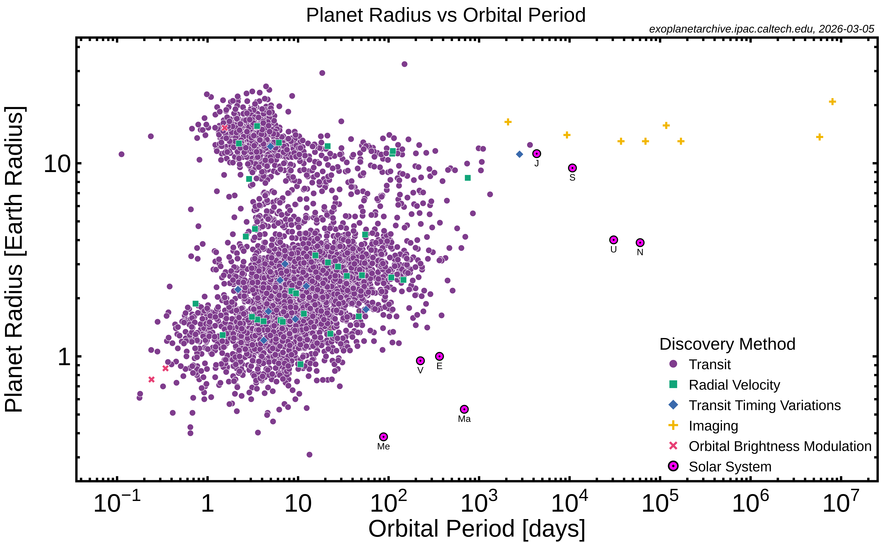
    <figcaption style="text-align:center; font-weight:normal; font-size:smaller">Confirmed exoplanets catalogued in the NASA Exoplanet Archive (dated 5 March 2026).</figcaption>
  </figure>

  Ultimately, this plot motivates further investigation into the underlying distribution of these populations, and if we can naturally define clusters that neatly separate these planets into component populations.

  Gaussian mixture models (GMMs) offer a promising approach for clustering multidimensional data into probabilistically-defined components, which would make them well-suited for identifying potential structure in this population of exoplanets. By first demonstrating that GMMs are effective at recovering known clusters in data, we can confidently apply them to the exoplanet dataset, with the aim of naturally segmenting them by their physical properties.

---

##### Introducing GMMs

  The Gaussian mixture model (GMM) is a probabilistic clustering technique, used to identify a set of clusters that best represent some observed distribution of data, assuming that each cluster takes on a multivariate Gaussian distribution (each cluster has its own mean and variance). This technique is described as an <b>unsupervised</b> learning method, as clusters are identified without requiring prior information about the data points’ classifications. 

  The idea behind the GMM is that each data point is assigned a probability of belonging to each cluster, weighted by how well it fits within each cluster's Gaussian distribution. This is achieved through the Expectation-Maximisation (EM) algorithm, which iterates over the clusters until the best model fit is achieved: clusters are first randomly initialised, the probabilities of each point being claimed by each cluster are calculated, then the cluster parameters are updated until the degree to which each cluster "claims" each data point does not increase significantly. The figure below shows a visual example of the GMM at work, assigning each point to clusters which are shown for better visualisation.

  <figure style="width:60%; margin:0 auto;">
      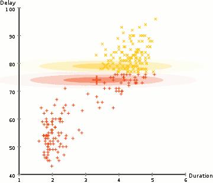
      <figcaption style="text-align:center; font-size:small; font-weight:normal">Example of GMM applied to eruption timing data from the Old Faithful geyser, as the EM algorithm is iterated until a solution converges. (<a href="https://brilliant.org/wiki/gaussian-mixture-model/">Source</a>)</figcaption>
  </figure>

  With these steps in mind, we have an idea of how the GMM should be able to identify clusters in data. 

---

##### Comparing distributions with K-S testing

  Our aim of using the GMM is to detect the underlying distribution of the exoplanet data; The output of the model is a set of  Gaussian components, each with their own parameters, which together form a mixed Gaussian distribution. However, if we want to confirm whether the exoplanet data is truly mixed-Gaussian, we need a statistical tool to compare the data to the proposed distribution.

  To do so, we use a Kolgomorov-Smirnov (K-S) test, a statistical test that measures how well two distributions match by comparing their cumulative distribution functions. We use a two-dimensional version, which works by dividing the plane around each data point into four quadrants and comparing the fractions of points within each quadrant between the two distributions. The test statistic $\mathcal{D}$ is the largest absolute difference found across all points and their respective quadrants; the smaller $\mathcal{D}$, the better the distribution describes the data.

  <figure style="width:60%; margin:0 auto;">
    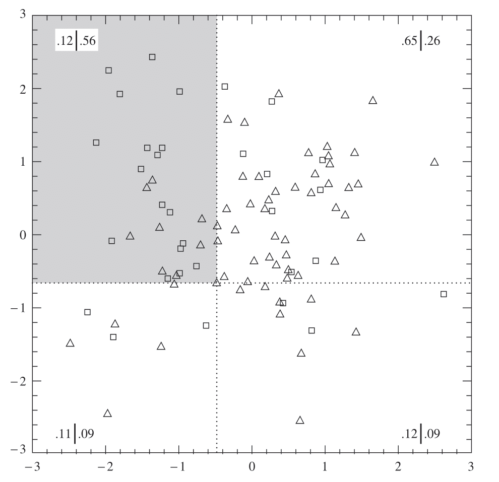
    <figcaption style="text-align:center; font-weight:normal; font-size:smaller"> Example of 2D K-S test. Values in corners correspond to fraction of points from respective datasets within quadrant, i.e. (Triangle | Square).</figcaption>
  </figure>

  The figure above shows a visualization of the quadrants for comparing two 2D data distributions made of 65 triangles and 35 squares. The dotted lines are centered on the triangle data point that maximizes the $\mathcal{D}$ statistic, with the maximum occurring in the upper-left quadrant. This quadrant contains 12% of all triangles and 56% of all squares, giving a $\mathcal{D}$ statistic value of 0.44.

  When applying this test to data, the null hypothesis assumes the data comes from a specific distribution. However, when the distribution is estimated from the data (as is the case in a GMM), this creates a dependency between the data and the parameters, leading to a biased $p$-value. To correct for this, we bootstrap the the K-S test over resampled data, to build an empirical distribution of $p$-values, giving a more robust estimate of the null hypothesis and its significance.

---

##### Validation on synthetic data

  To test the GMM, we generate synthetic data for three multivariate normal distributions, each with its own mean and covariance matrix, totaling 2,000 points. Plotting the data points:

  <figure style="width:60%; margin:0 auto;">
    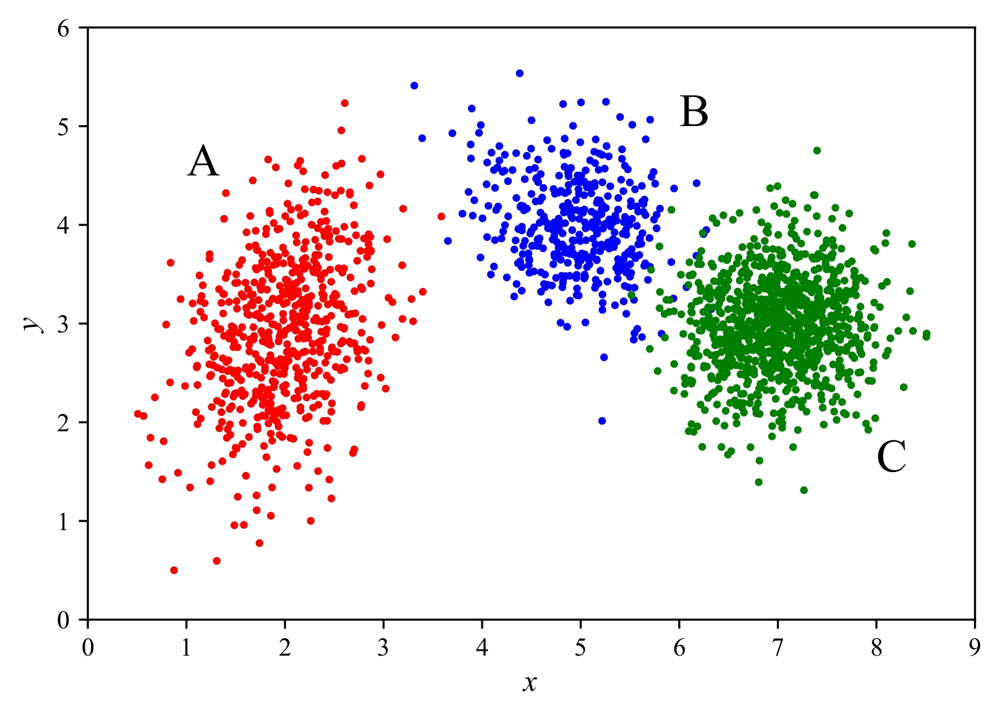
    <figcaption style="text-align:center; font-weight:normal; font-size:smaller">Synthetic data generated from a GMM with 3 clusters.</figcaption>
  </figure>

  <!-- 

  
Show code for this plot

  

  import numpy as np
  import matplotlib.pyplot as plt
  import matplotlib.ticker as ticker

  np.random.seed(107)

  # Define 3 gaussian clusters then stack all points together
  means = [
      [2, 3],
      [5, 4],
      [7, 3]
  ]

  covariances = [
      [[0.25, 0.125], [0.125, 0.5]],
      [[0.25, -0.075], [-0.075, 0.25]],
      [[0.25, 0], [0, 0.25]]
  ]

  colors = ['red', 'blue', 'green']
  num_points = [600, 400, 1000]

  points = []
  labels = []
  point_colors = []

  for mean, cov, n, color in zip(means, covariances, num_points, colors):
      data = np.random.multivariate_normal(mean, cov, n)
      points.append(data)
      labels.extend([color] * n)
      point_colors.extend([color] * n)

  all_points = np.vstack(points)

  # Plot all distributions on the same graph
  fig, ax = plt.subplots(1, 1, figsize=(5.5, 4))

  cluster_labels = ['A', 'B', 'C']

  for data, color, label in zip(points, colors, cluster_labels):
      ax.scatter(data[:, 0], data[:, 1], color=color, s=4, alpha=1, label=f'Cluster {label}')

  ax.set_xlabel(r"$x$")
  ax.set_ylabel(r"$y$")
  ax.set_xlim(0, 9)
  ax.set_ylim(0, 6)
  ax.yaxis.set_major_locator(ticker.MultipleLocator(1))
  ax.xaxis.set_major_locator(ticker.MultipleLocator(1))
  ax.legend()

  fig.tight_layout()
  plt.show()

   

  
 -->

  We use the GMM implementation from <a href="https://scikit-learn.org/stable/modules/mixture.html">`scikit-learn`</a>, initialising cluster parameters using k-means clustering, and allowing each cluster to have a unique general covariance matrix, enabling them to have distinct shapes and orientations. For the GMM, 100 iterations of the EM algorithm are performed, or until convergence is achieved. To show that the clustering model does achieve convergence, we plot the natural log likelihood as a function of iteration:

  <figure style="width:60%; margin:0 auto;">
      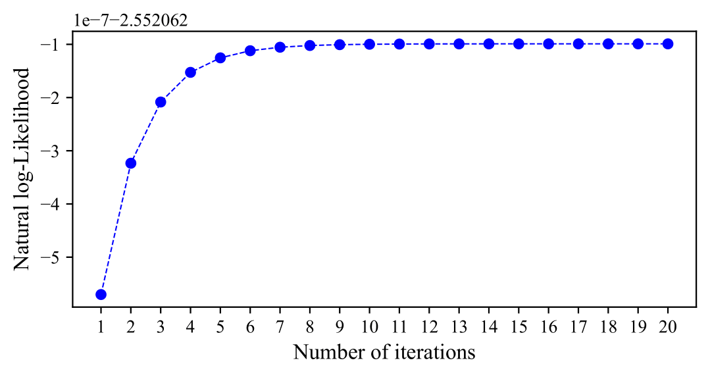
      <figcaption style="text-align:center; font-weight:normal; font-size:smaller">Natural log likelihood at each iteration step of the EM algorithm.</figcaption>
  </figure>

 We can see that the model converges after around 10 iterations of the EM algorithm, as the natural log likelihood does not increase significantly with further iterations. To select the best model, the GMM is refitted 100 times, and the parameters of the model with the highest likelihood given the data are stored. Applying the GMM to the synthetic data, we can display the 1$\sigma$, 2$\sigma$, and 3$\sigma$ confidence ellipsoids of the Gaussian components on top of the data:

  <figure style="width:60%; margin:0 auto;">
    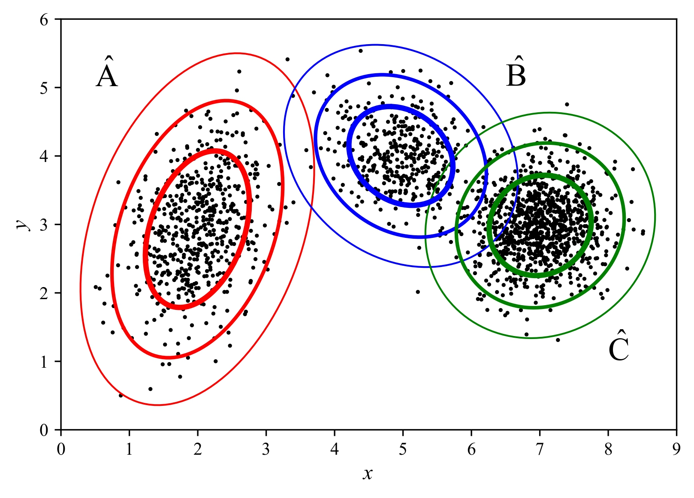
    <figcaption style="text-align:center; font-weight:normal; font-size:smaller">Synthetic Gaussian-distributed data with 1$\sigma$, 2$\sigma$, and 3$\sigma$ confidence ellipsoids of GMM component clusters superimposed.</figcaption>
  </figure>

  <!-- 

  
Show code for this plot

  

  from matplotlib.patches import Ellipse
  from sklearn.mixture import GaussianMixture
  from scipy.stats import chi2
  import time

  # Define a function that will return the GMM and the labels predicted for a set of data
  def gaussian_mixture_procedure(data, n_clusters, n_init, max_iter, message=True):
      gmm = GaussianMixture(n_components=n_clusters, covariance_type='full', n_init=n_init, init_params='kmeans', max_iter=max_iter)
      gmm.fit(data)
      labels = gmm.predict(data)

      return gmm, labels

  # Function for plotting ellipses of clusters
  def plot_gmm_contours(gmm, X_log, ax, conf, lw):
      colors = ['red', 'blue', 'green', 'purple', 'orange']
      
      # Sort GMM components by the x-value of the means, ensuring constant ellipse ordering
      sorted_indices = np.argsort(gmm.means_[:, 0])
      sorted_means = gmm.means_[sorted_indices]
      sorted_covariances = gmm.covariances_[sorted_indices]
      sorted_weights = gmm.weights_[sorted_indices]
      
      # Loop through each sorted cluster
      for i, (mean, covar, weight, label) in enumerate(zip(sorted_means, sorted_covariances, sorted_weights, cluster_labels)):
          eigenvalues, eigenvectors = np.linalg.eigh(covar)
          angle = np.degrees(np.arctan2(*eigenvectors[:, 0][::-1]))
          
          v = np.sqrt(chi2.ppf(conf, 2))
          width, height = 2 * v * np.sqrt(eigenvalues)

          # Plot ellipse per cluster
          ellipse = Ellipse(
              mean, width, height,
              angle=angle,
              edgecolor=colors[i % len(colors)], 
              facecolor='none',
              linewidth=lw,
              # label=fr"Cluster {label}$"
          )
          ax.add_patch(ellipse)

  n_clusters = 3
  n_init = 100
  max_iter = 100
  test_gmm, labels = gaussian_mixture_procedure(data=all_points, n_clusters=n_clusters, n_init=n_init, max_iter=max_iter)

  fig, ax = plt.subplots(1, 1, figsize=(5.5, 4))
  scatter = ax.scatter(all_points[:, 0], all_points[:, 1], s=5, alpha=1, edgecolors='none', color='k', cmap='viridis')

  ax.set_xlabel('$x$', fontsize=12)
  ax.set_ylabel('$y$', fontsize=12)

  plot_gmm_contours(test_gmm, data, ax, conf=0.997, lw=1)
  plot_gmm_contours(test_gmm, data, ax, conf=0.955, lw=2)
  plot_gmm_contours(test_gmm, data, ax, conf=0.683, lw=3)

  ax.set_xlabel(r"$x$")
  ax.set_ylabel(r"$y$")

  ax.yaxis.set_major_locator(ticker.MultipleLocator(1))
  ax.xaxis.set_major_locator(ticker.MultipleLocator(1))

  fig.tight_layout()
  plt.show()

   -->

  
 

  Looking at the figure above, we can see that the GMM successfully recovers the three underlying Gaussian components of the source data. 

  To determine the optimal number of clusters, a balance must be reached between how well the GMM fits the data and the complexity of the model, characterized by the number of clusters. This is quantified using the Bayesian Information Criterion (BIC), which combines the model likelihood with a penalty for adding more clusters and increasing model complexity. The model with the lowest BIC is preferred, though we prioritize simplicity, opting for a model with fewer components even if it results in a slightly higher BIC. Plotting the BIC score for the GMM with increasing clusters:
  
  <figure style="width:60%; margin:0 auto;">
    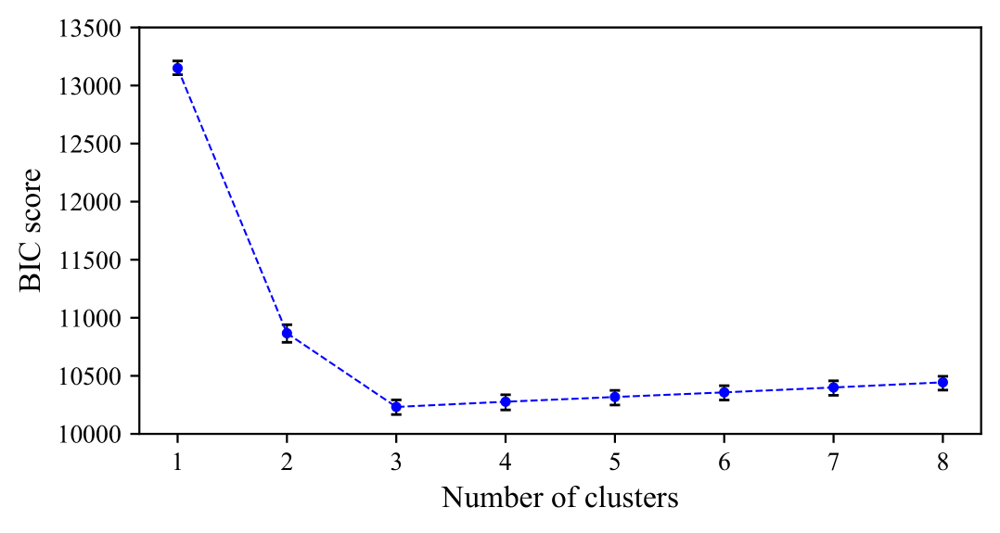
    <figcaption style="text-align:center; font-weight:normal; font-size:smaller">BIC score with increasing number of clusters.</figcaption>
  </figure>

  We see that the lowest BIC is reached for a GMM fitted with $k$ = 3 clusters, with no significant improvement with increasing clusters, and conclude that the data is best described by 3 clusters, as anticipated.
  
  To assess how well the data follows the proposed multivariate Gaussian distribution, we apply the 2D K-S test using the package <a href="https://github.com/syrte/ndtest">`ndtest`</a>. A bootstrap analysis is applied with 200 trials, resampling data from the fitted GMMs and calculating the $p$-values for each sample. Plotting the distribution of $p$-values:

  <figure style="width:80%; margin:0 auto;">
    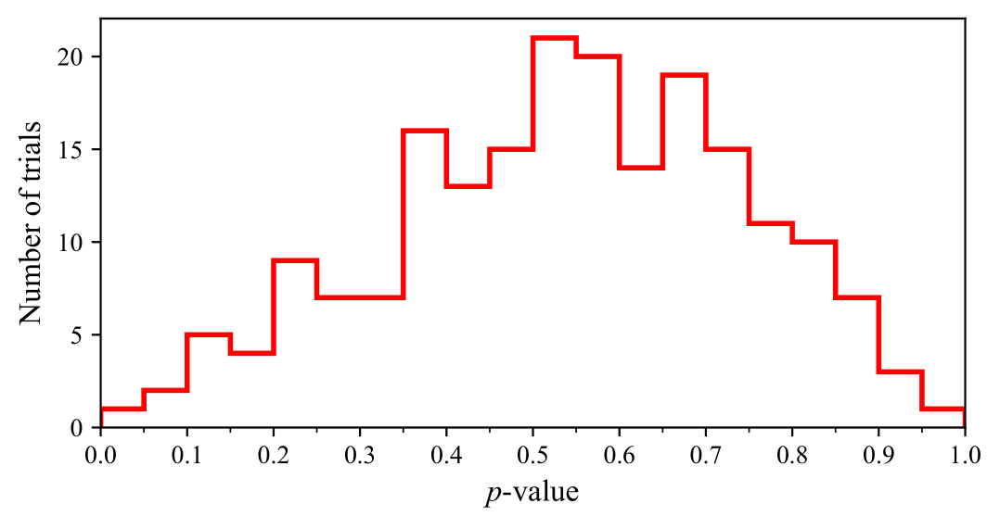
    <figcaption style="text-align:center; font-weight:normal; font-size:smaller">Distribution of $p$-values from bootstrapping the 2D K-S test, comparing fitted GMM to synthetic data.</figcaption>
  </figure>

  We see a resulting uniform distribution of $p$-values between 0 and 1, which supports the null hypothesis, indicating that the data is indeed drawn from a multivariate Gaussian distribution, as expected.

  We conclude that the GMM is capable of detecting Gaussian structures in multidimensional data. With that, we can apply this clustering technique to examine the underlying distribution of real-world data.

---

##### Applying GMMs to exoplanet data

  With the methodology in place, we are ready to apply the GMM to exoplanet data. We collect data from the NASA Exoplanet Archive (updated as of March 19, 2025), containing 38,157 referenced exoplanet parameter measurements and uncertainties for 5,856 exoplanet candidates. As we focus on identifying clusters in the parameter space of orbital period ($P$) and planetary radius ($R$), we calculate the aggregate mean for the period and radius measurements of each exoplanet, excluding entries with undetermined values for either parameter. This results in a reduced dataset of 4,407 exoplanets, whose respective parameters are plotted below:

  <figure style="width:80%; margin:0 auto;">
      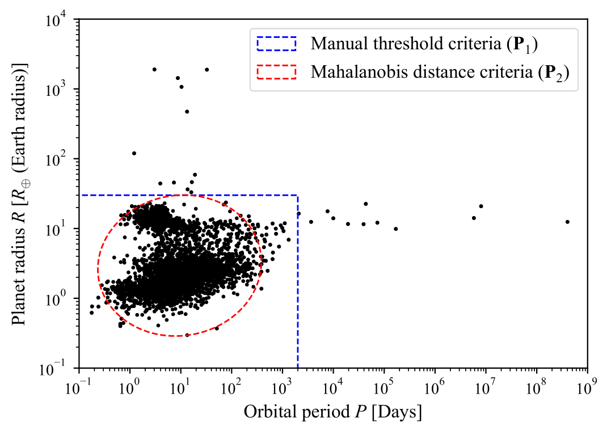
      <figcaption style="text-align:center; font-weight:normal; font-size:smaller">Orbital period vs radius of reduced exoplanet dataset. </figcaption>
  </figure>

  Looking at the plot, we identify two trails of outlying exoplanets: those to the right of the central mass with radii around $R \sim 10^1 \ R_{\oplus}$ (Earth radius), as well as those above the central mass with radii greater than $R \sim 5 \times 10^1 \ R_{\oplus}$. These outliers could affect the GMM's ability to fit meaningful clusters, so we apply two different outlier removal strategies to see how sensitive the results are to this choice.

  The first method is to manually define a bounding box, considering only exoplanets within $0 \leq P \leq 2 \times 10^3$ days and $0 \leq R \leq 3 \times 10^1 \ R_{\oplus}$. This sample, $\mathbf{P}_1$, contains 4,383 exoplanets (24 are excluded). The second method uses the Mahalanobis distance, which measures how far a point sits from the mean of a distribution, while accounting for the variance and correlation of the data. We consider points within the 97.5\% confidence interval as non-outliers, giving a sample $\mathbf{P}_2$ of 4,333 exoplanets (74 are excluded). 

  We define our parameter space as the base-10 logarithms of the exoplanet radius and period, i.e., $x = \left(\log_{10}(P), \log_{10}(R)\right)$. We then apply the GMM to the datasets $\mathbf{P}_1$ and $\mathbf{P}_2$, following the same steps as was done when first validating the methods. Plotting the BIC scores with increasing model complexity:

  <figure style="width:60%; margin:0 auto;">
      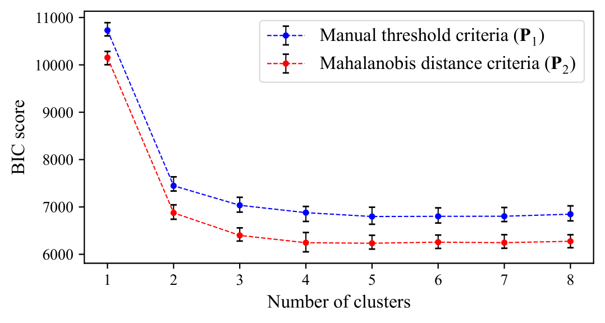
      <figcaption style="text-align:center; font-weight:normal; font-size:smaller">BIC score with increasing clusters for the exoplanet data.</figcaption>
  </figure>

  Inspecting the BIC scores, both datasets demonstrate a negligible change in BIC beyond $k=4$ clusters, which we determine to be the optimal number of clusters for both $\mathbf{P}_1$ and $\mathbf{P}_2$. Plotting both datasets with overlaid $1\sigma$ confidence ellipsoids for the fitted GMM cluster components:

  

    <figure style="flex:1; margin:0;">
      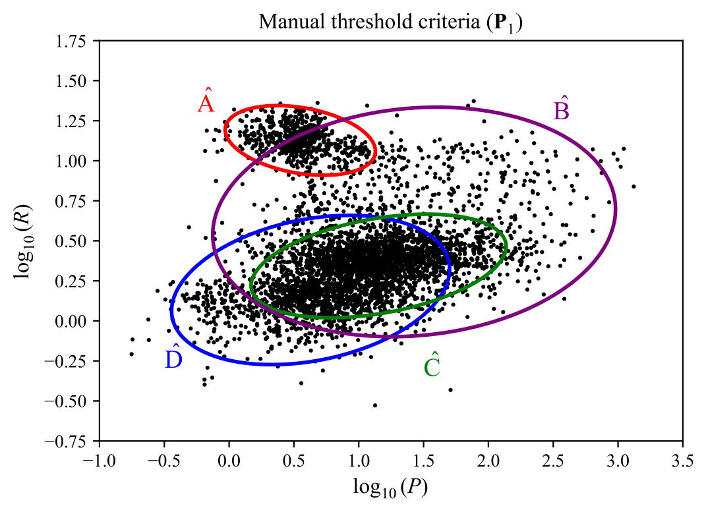
      <!-- <figcaption style="text-align:center; font-size:smaller"><b>Figure 9a:</b> Dataset $\mathbf{P}_1$, $k=4$.</figcaption> -->
    </figure>
    <figure style="flex:1; margin:0;">
      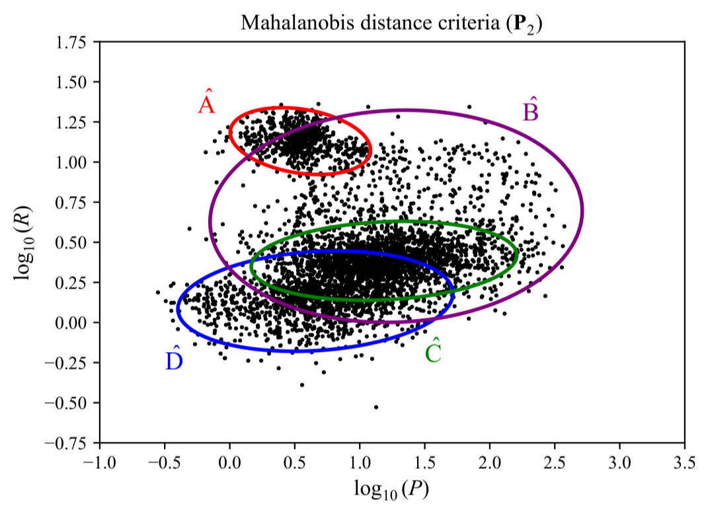
      <!-- <figcaption style="text-align:center; font-size:smaller"><b>Figure 9b:</b> Dataset $\mathbf{P}_2$, $k=4$.</figcaption> -->
    </figure>
  

  
Exoplanet datasets with $1\sigma$ confidence ellipsoids of GMM components overlaid. 

   

  We can see that the choice of outlier detection method influences the configuration of the Gaussian components: the manual threshold criterion permits more data points to remain outside a well-defined boundary, resulting in clusters that are more loosely defined by the GMM, while the Mahalanobis distance criterion removes a greater number of peripheral data points, leading to a more constrained definition of cluster boundaries. However, as the clusters in both models are spatially similar, we cannot conclude that one outlier method is superior at uncovering "real" clusters than the other.

  We perform a two-dimensional K-S test as described previously, to test how well the exoplanet data fits the prescribed GMM distribution. To do so, we sample data points from the fitted GMM and compare them with the exoplanet data distribution by computing the corresponding $p$-values, conducting 200 bootstrap trials. Plotting the resulting distribution of $p$-values: 

  <figure style="width:60%; margin:0 auto;">
      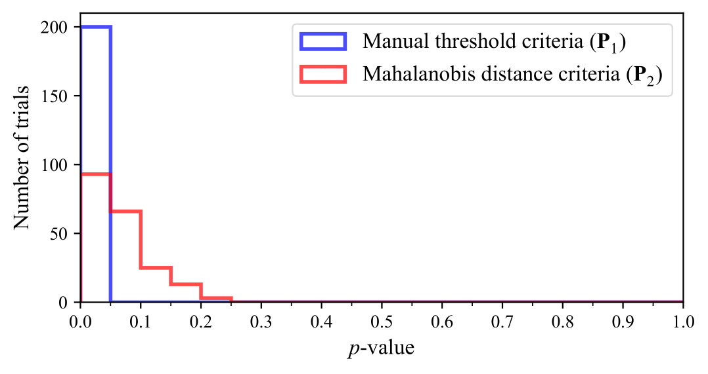
      <figcaption style="text-align:center; font-weight:normal; font-size:smaller">Distribution of $p$-values from 200 bootstrap trials of the 2D K-S test, comparing the fitted GMM to the source exoplanet period-radius data.</figcaption>
  </figure>

  For $\mathbf{P}_1$, we observe that all trials fall within the $0\leq p \leq 0.05$ bin, suggesting that the null hypothesis—that the data is drawn from the same distribution as the fitted GMM samples—is unlikely. Similarly, for $\mathbf{P}_2$, the majority of $p$-values fall in the $0\leq p \leq 0.05$ bin, decreasing until no trials yield a $p>0.2$. This indicates that there is little statistical support for the assumption that the dataset follows Gaussian clusters.

  This result contrasts with our validation on synthetic data, where the GMM successfully recovered the underlying cluster structure, yielding a uniform $p$-value distribution consistent with the null hypothesis. The fact that a similar $p$-value distribution was not found for the observed exoplanet period-radius data suggests that it is not fully described by a multivariate Gaussian distribution. However, despite this limitation, the GMM still provides an optimal partitioning of the data into distinct components, which may capture meaningful structures even if the clusters themselves are not strictly Gaussian.

---

##### Discussion

  While the GMM proved effective in locating clusters in data that is known to be Gaussian distributed, applying it to the exoplanet data reveals a potential limitation. The K-S test indicated that the data is not consistent with a purely Gaussian origin, suggesting that the underlying distribution of exoplanet populations may be more complex than initially assumed. 
  
  It is possible that the identified Gaussian clusters may be artifacts arising from approximating a non-Gaussian data distribution. This can be influenced by selection effects or biases in the observed data, which may lead to artificial clustering. An approach to address this caveat when using GMMs is to compare the identified clusters with existing observational evidence from other studies (see <a href="https://arxiv.org/abs/1205.6221">Lee et al. 2012</a> on using GMMs to find empirical categorisation bounds for pulsars). In doing so, one can assess whether the fitted clusters reflect genuinely Gaussian distributions or are simply approximations from model limitations. Extensions to this project could explore non-Gaussian mixture models, which might better capture the underlying distribution of the data.

