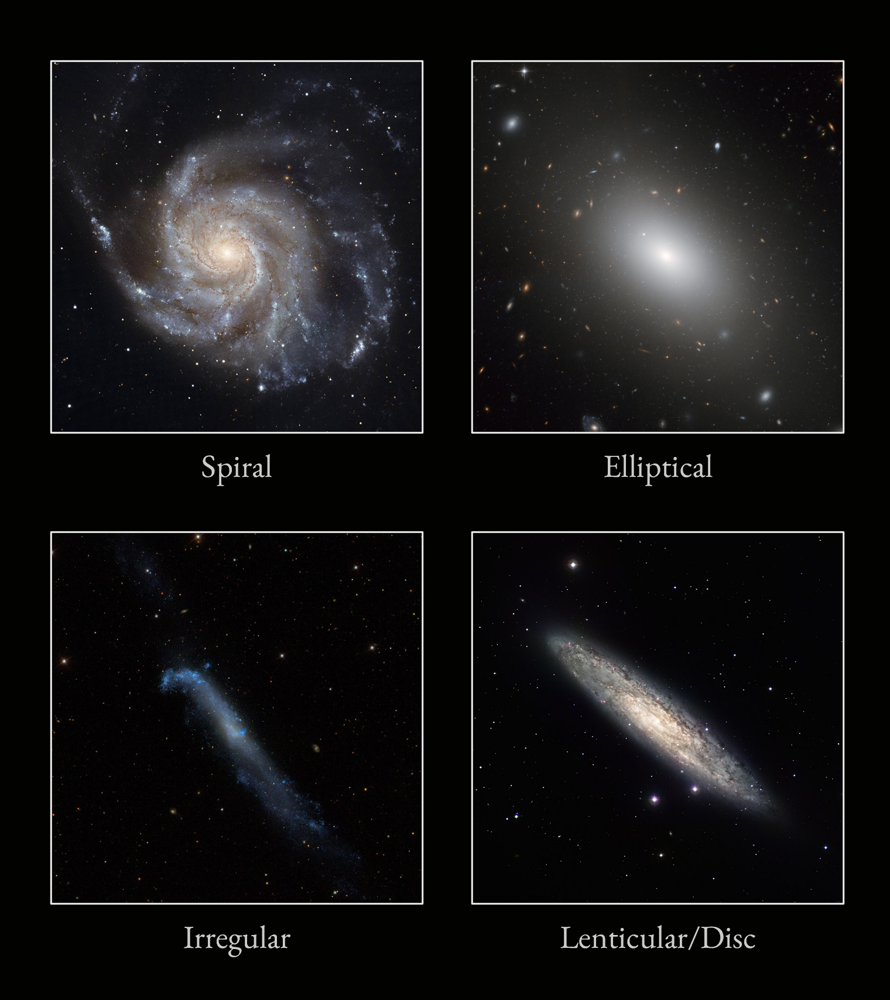
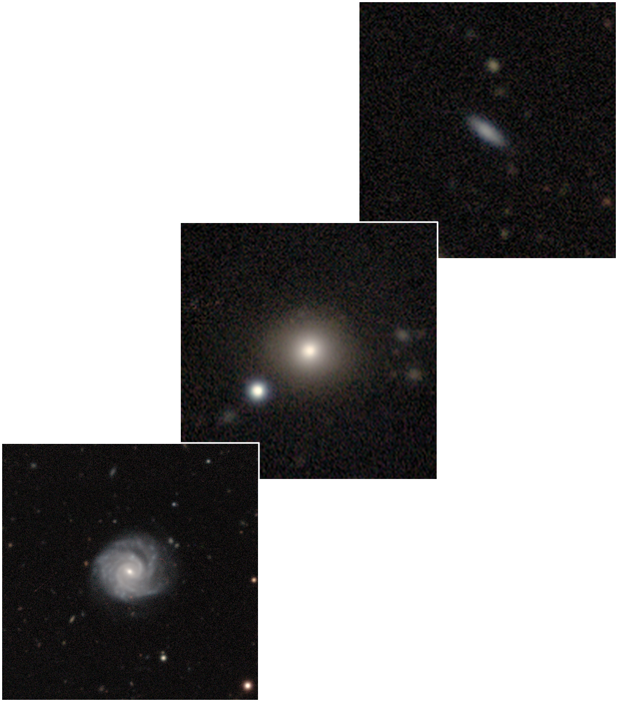
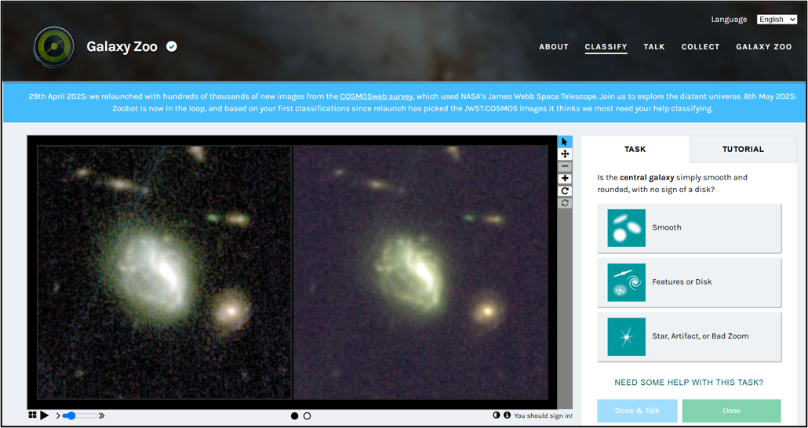
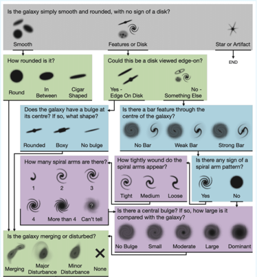
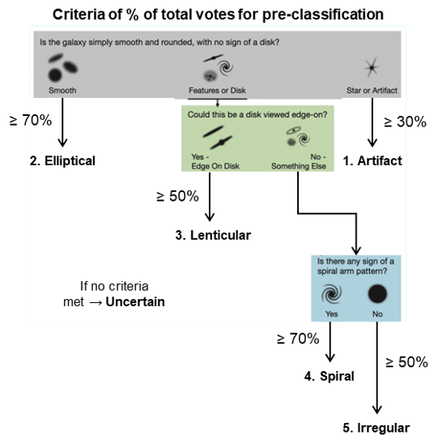
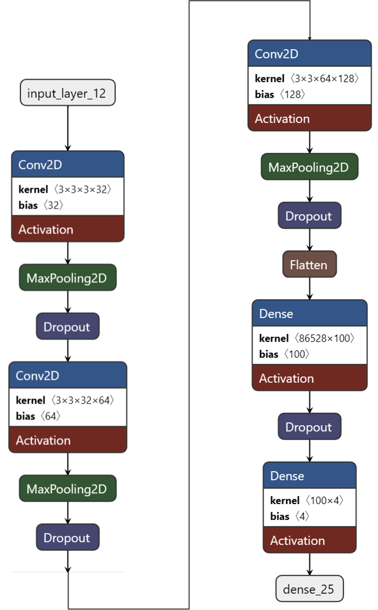
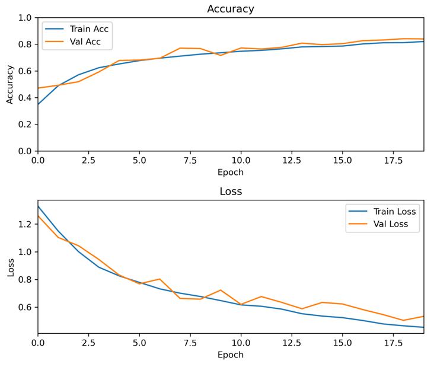
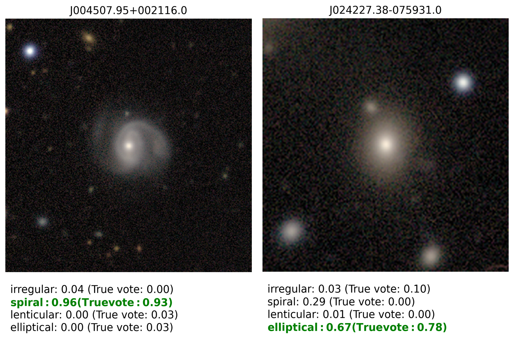
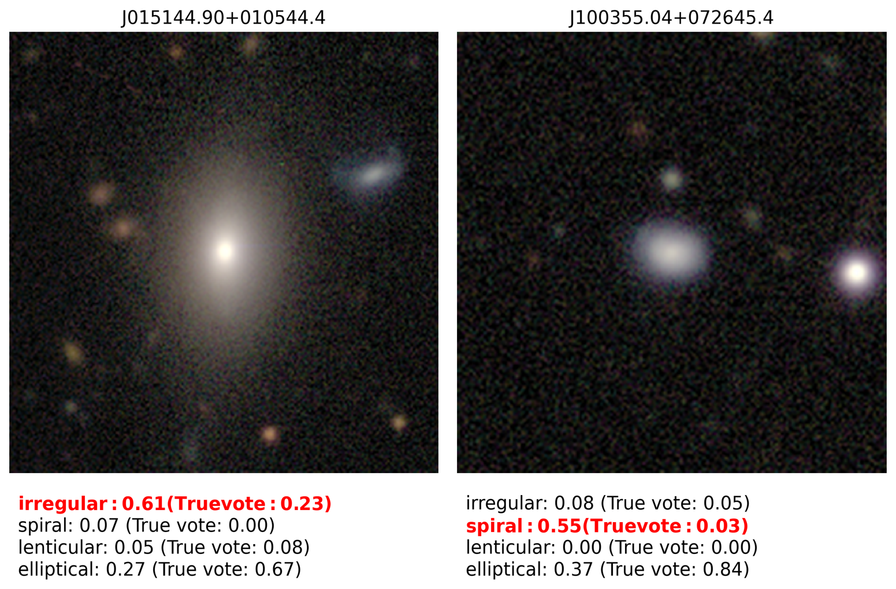
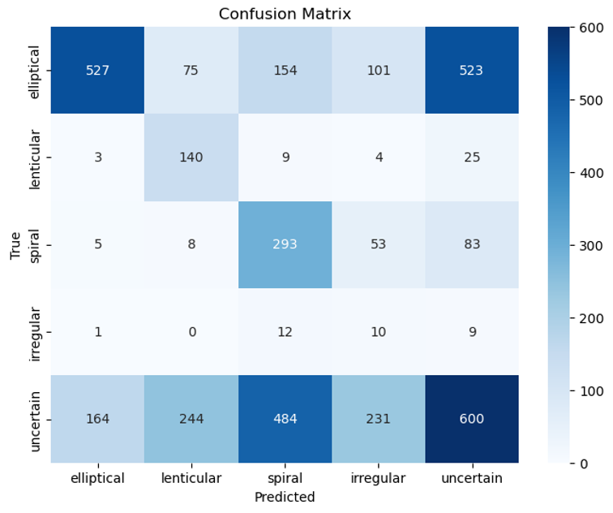

---

##### Project description

  This project looks at the complex task of computer-based classification of images, by means of a convolutional neural network. This was done as part of a final group project for the course <a href="https://kurser.ku.dk/course/nfyk15002u">Applied Machine learning</a>, run by A. Prof. Troels Petersen (University of Copenhagen) between April and May of 2025.

  Please note that this portfolio is still under construction as of 10/12/2025, where I hope to add some more detail later on.

---

##### Introduction

  <figure style="width:100%; margin:0 auto;">
      
      <figcaption style="text-align:center; font-weight:normal">Example of galaxies of differing morphology.</figcaption>
  </figure>

  - Galaxies have complicated, individual morphologies
  - CNNs offer a promising approach to image-based pattern recognition
  - Galaxy surveys offer a wealth of image data, and citizen science projects allow us to label these galaxies and their features
  
  Question: <em> Can we train a model that can classify or identify features from survey images of galaxies?</em>

---

##### Data

Data sourced from the Dark Energy Camera Legacy Survey (DECaLS):
- Data Release 5 (DR5)
- Dataset consist of 253,286 survey images of galaxies
- Image size: 424 x 424 x 3 (RGB)
- Pre-cropped and centered on objects

<figure style="width:100%; margin:0 auto;">
    
    <figcaption style="text-align:center; font-weight:normal">Example of images from the DECaLS dataset.</figcaption>
</figure>

Challenges regarding the data:
- Varying image quality and noise levels
- Small class imbalance (Elliptical and spiral galaxies seemingly more common)
- Some images may contain nearby stars or multiple objects

Now that we have the 'features' data in mind (i.e. the DECaLS image data), we need the labels to match. To do so, we make use of <a href="https://www.zooniverse.org/projects/zookeeper/galaxy-zoo/">Galaxy Zoo</a>:

<figure style="width:100%; margin:0 auto;">
    
    <figcaption style="text-align:center; font-weight:normal">Still from the Galaxy Zoo site.</figcaption>
</figure>

- Citizen science project that enlists online volunteers to visually classify galaxies
- Galaxy Zoo DECaLS 5 (GZD-5) campaign 
- Provides effective ‘labels’ for DECaLS image data
- Classifications are completed by volunteers using a decision tree question schema
- Dataset: Number of votes for each question and choices for DECaLS galaxies
- Total votes per galaxy cluster around 5 or 40 (Some images with high ML potential have been ‘promoted’)

<figure style="width:100%; margin:0 auto;">
    
    <figcaption style="text-align:center; font-weight:normal">Voting scheme for the Galaxy Zoo DECaLS 5 (GZD-5) campaign.</figcaption>
</figure>

---

##### Data Preprocessing

1. <b>Filtering by votes for reliability</b>--Removing galaxy entries that received very few volunteer votes, which could make their classification unreliable, improving label quality.
2. <b>Selecting relevant classification labels</b>--Keeps only the subset of label columns needed for particular approach.
3. <b>Removing NaN values</b>--Ensures that only galaxies with complete and usable labels are included → avoids training on incomplete or ambiguous label data.
4. <b>Matching image files to labels</b>--Drops galaxies with missing image files. Important since the data contains images from all Galaxy Zoo campaigns.
5. <b>Resizing images to 224 x 224 pixels</b>--Reduces array size and decreases training time.

---

##### Approaches

In researching the scope of this project, we found two ways to look at classifying these galaxy images:

+ <b>Multi-class classification</b>: Classify galaxies into broad morphological types, e.g. <em>spiral</em>, <em>elliptical</em>, <em>irregular</em>, <em>lenticular</em>
+ <b>Multi-label classification</b>: Predict detailed multi-label features such as <em>bar strength</em> and <em>disk orientation</em>

It is worth noting that unlike multi-class classification, where each image belongs to only one class, multi-label classification allows multiple labels per image.

In my part of this project, I focused on <em>multi-class classification</em>, which I will elaborate on below.

---

##### Multi-class classification: The idea

- What if we only fed images to the CNN that have a confident volunteer consensus?
- Goal: Classify images into one of four classes*

Further preprocessing required:
1. Mapping GZ5-D votes to hard class labels based on custom confidence thresholds (to the right). This was based off seeing at what threshold, that a batch of sample images would appear homogeneous
2. Images classified as uncertain/artifact removed from training set → Avoids training on an ambiguous class
3. Large class imbalance → Data augmentation to the rescue! (rotating and flipping until balanced)

*<em>Provided that the maximum class prediction probability exceeded a threshold. </em>

<figure style="width:100%; margin:0 auto;">
    
    <figcaption style="text-align:center; font-weight:normal">Voting scheme for the Galaxy Zoo DECaLS 5 (GZD-5) campaign, with modifications made to show how hard class labels were encoded to data.</figcaption>
</figure>

---

##### Building a CNN

- Self-built CNN using <a href="https://keras.io/api/models/sequential/">Keras Sequential</a> stacking
  - 3 × 2D Convolutional layers
  - Dropout layers (25%)
- Adam optimiser, learning rate of 0.0001
- Run for 20 epochs
- Class-balanced training sample of 9000 galaxies and a 25% testing set (3000 galaxies)
- Output is a softmax probability of the 4 encoded classes: Elliptical, Lenticular, Spiral, and Irregular.

<figure style="width:100%; margin:0 auto;">
    
    <figcaption style="text-align:center; font-weight:normal">Diagram of the CNN constructed for multi-class classification.</figcaption>
</figure>

---

##### Results

Looking at both the confusion matrix and learning curves for this CNN:

<figure style="width:100%; margin:0 auto;">
    
    <figcaption style="text-align:center; font-weight:normal">Diagram of the CNN constructed for multi-class classification. Taken from a 20% testing set derived from augmented 4-class data.</figcaption>
</figure>

<figure style="width:100%; margin:0 auto;">
    
    <figcaption style="text-align:center; font-weight:normal">Training and validation accuracy and loss plots for multi-class classification .</figcaption>
</figure>

As can be seen in the learning curves, the CNN appears to not be overfitting, which is a positive sign.

We can also test how effective the CNN is at predicting classes for some example images:

<figure style="width:100%; margin:0 auto;">
    
    
    <figcaption style="text-align:center; font-weight:normal">Predicted label probabilities for four galaxies.</figcaption>
</figure>

As can be seen, the classifier is very confident on galaxies that appear to be spiral, whilst some elliptical/irregular images have a larger drop in confidence, and end up being incorrectly classified.

---

##### Discussion/Caveats

It is worth noting that the effectiveness of the classifier is predicated on how it is designed, and how the label data is fed into the model. In constructing this classifier, we have attempted to reduce the data sample to only those whose morphology has been democratically identified with a high degree of confidence, and feeding these labels into the model.

An alternative approach to removing images that do not have high confidence are to define a peripheral 'uncertain' category to be those with not a high confidence in any particular class ($<0.6$). Repeating the classification on a common validation set yields the following confusion matrix:

<figure style="width:100%; margin:0 auto;">
    
    <figcaption style="text-align:center; font-weight:normal">Diagram of the CNN constructed for multi-class classification, with addition of an 'uncertain' class.</figcaption>
</figure>

We see that the model has capabilities to identify morphological features, but the validation set has a high 'uncertain' population, reflected in this category. This may be an inherent fault in trying to encode noisy fractional data into hard labels, which has affected the models performance. If two galaxies are pre-labelled as uncertain, but one has a 55% classification as a spiral, while another has a 30% classification as a spiral, shouldn't the model know that? A future model could keep the softmax-type input provided by the Galaxy Zoo results, at the cost of hard class definitions, but will aid in providing a measure of confidence for those who are interested in knowing how one would classify a galaxy.

---

##### Related material

- [Original project slides (.pdf)](aml_galaxy_classification_slides.pdf)