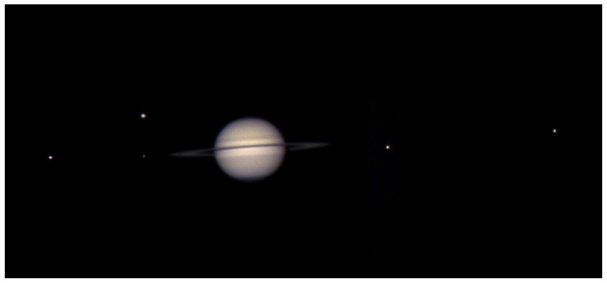
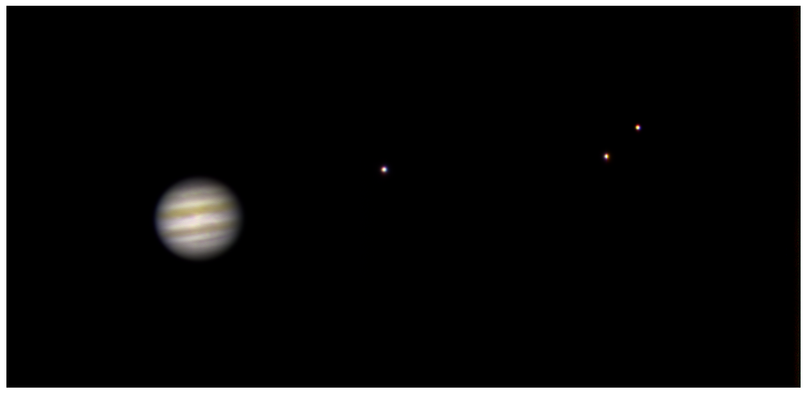

---

##### Description

  I was selected to participate in the <a href="https://phys.au.dk/ida/events/not-summer-school-2025">2025 NOT Summer School</a>, a master's level summer course with the purpose of making students familiar with fundamental techniques in observational astrophysics. This comprised of a week of theory and planning observations at the Niels Bohr Institute, followed by seven days at the Roque del los Muchachos Observatory on the island of La Palma, to conduct our observations using the <a href="https://phys.au.dk/ida/the-nordic-optical-telescope">Nordic Optical Telescope</a> (NOT). Our final group report, describing the observations and projects below, can be found <a href="NOT_Summer_School_Report.pdf"><b>here</b></a>.

  <!-- The school was a great way to gain experience across all aspects of the observational process: Choosing what targets to observe and planning observation blocks, travelling to the telescope and actively making those observations, and finishing off by reducing the captured data into distilled results or nice plots. -->

---

##### Choosing what to observe

  During the course of the observing nights, we observed a wide range of objects based on our own research focuses and personal interests. Our motive for selecting targets of interest was two-fold: To <b>examine objects with a convincing science case</b>, and to <b>observe objects for their unique and aesthetically-pleasing features ('pretty pictures')</b>. We also chose a range of projects that would make use of various observational and scientific techniques. These projects consisted of:

  - Observing potential quasar candidates, acquiring their spectra to confirm whether or not they were quasars, as well as observing two lensed quasar candidates.
  - Recording spectra of the interstellar comet 3I/ATLAS, capturing a timelapse of its motion, and attempting to observe it occulting a star with the goal of creating an absorption spectrum of the comet atmosphere.
  - Capturing spectra of the binary red giant-white dwarf star system T Coronae Borealis in wake of its impending nova, estimated to happen every 80 years.
  - Assisting a student group from Aarhus University to capture radial-velocity measurements for the star WASP-76, taken in order to measure the mass and orbital period of its planetWASP-76b.
  - Taking pretty pictures of the Fireworks Galaxy (NGC 6946), Snowglobe Nebula (NGC 6781), supernova remnant SN1181, and the Owl Cluster (NGC 457), as well as Jupiter and Saturn in multiple filters to create a natural colour image, and attempting to capture the transit of Titan in front of Saturn.

  As part of selecting targets, I put forward that we use the NOT to observe Jupiter and Saturn, to get really nice photo of the two planets and their brightest moons.

---

##### Saturn

  We observed Saturn between 02:22 and 02:31 UTC on 19 August 2025, using S[II] (673 ±1nm), Hα (656 ±3nm), and O[III] (501 ±3nm) filters. These image filters were chosen to as to use them respectively as red, green, and blue composite images to form a natural colour image. We specifically selected narrowband filters to avoid oversaturating the image by the sheer brightness of Saturn. The exposure times chosen for each filter were 0.7s, 0.3s, and 0.2s respectively.

  Individual frames were bias-subtracted and flat-fielded using <a href="https://ccdproc.readthedocs.io/en/latest/">`CCDproc`</a>, before being aligned, stacked, and colourised. A workflow in Python was written to manage the alignment and colourisation process. Because of Saturn's high brightness compared to its faint moons, it was not possible to apply a single contrast stretch that revealed detail in Saturn while also making the moons visible without amplifying background noise. To resolve this, we divided the image into vertical segments, such that Saturn was isolated into one segment while the fainter moons were placed in their own segment. Then, a higher gamma correction was applied to the Saturn segment to enhance darker details, while a lower gamma correction was applied to the moon-containing segments to increase their brightness without the background overwhelming them. These vertical segments were then stitched together like a mosaic, and were chosen such that each moon could be aligned independently (due to seeing effects causing a distortion in the moons' position between frames). The final image of Saturn is shown below. 

  <figure style="width:100%; margin:0 auto;">    
    
    <figcaption style="text-align:center; font-weight:normal; font-size:smaller">Real-colour image of Saturn and 5 of its moons (from left to right: Dione, Titan (above), Mimas (below), Tethys, Rhea).</figcaption>
  </figure>

  A future improvement would be stacking several exposures together to increase the overall signal-to-noise ratio of the image. We attempted to do so using PIPP and <a href="https://www.autostakkert.com/">Autostakkert!3</a>, which are software products often used for amateur astrophotography. However these programs were unable to read the 32bit FITS files produced by the ALFOSC instrument. Therefore, automated stacking could not be completed, and the resultant image is the result of manually aligning and stacking the three filter frames. As a result, there is a slight discolouration in the moons, where shades of red, green, and blue are visible on the edges of each moon, despite best attempts to resolve this by aligning the vertical segments containing each moon.

  We learned on the day of the observation that the shadow of Titan was to transit across the surface of Saturn that day. Due to an error in the conversion from local time to UTC, we discovered during the observing slot that we were unable to capture the event. Another student group from SDU participating in the school were fortunately able to observe the transit, which began at 05:33 UTC.

---

##### Jupiter

  We followed a very similar procedure to imaging Saturn in order to image Jupiter, due to their similar compositions and use of manual tracking. We observed Jupiter between 05:37 and 05:53 UTC on 20 August 2025, using three narrowband filters: S[II] (673 ±1nm), Hα (656 ±3nm), and O[III] (501 ±3nm). The exposure times for the images in all filters was 0.1s. An initial challenge with observing Jupiter was the timing, since it only rose to 10◦ above the horizon before the end of civil twilight, shortly followed behind by the waning moon (although this would not have greatly affected our observing ability). We therefore placed this observation at the end of the night, where we continued observations into civil twilight due to Jupiter's brightness, and were able to obtain images using the ALFOSC instrument. We hoped to observe all four Galilean moons (Ganymede, Europa, Callisto, Io), but Io was behind Jupiter and could not be observed; No other timeslot available during the week permitted us to observe Jupiter due to its late visibility window, so it was effectively unobservable.

  <figure style="width:100%; margin:0 auto;">    
    
    <figcaption style="text-align:center; font-weight:normal; font-size:smaller">Real-colour image of Jupiter and 3 of the Galilean moons (from left to right: Ganymede, Europa, Callisto). </figcaption>
  </figure>
  
  We processed the Jupiter images using the same stacking and colourisation script made for the Saturn images, with similar gamma corrections done separately for Jupiter compared to its moons to make all bodies visible in a single image. The final image suffers from the same issue as the Saturn image, in that there are visible edge discolourations in the moons due to imperfect alignment of the composite frames.

