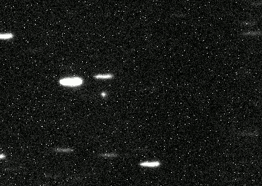
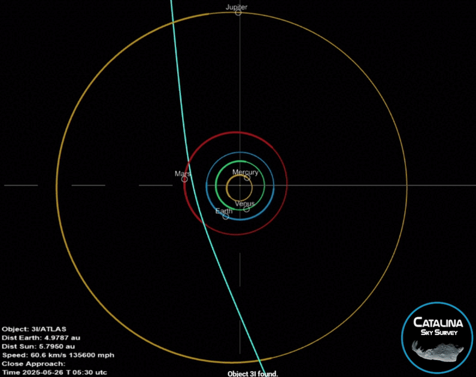

##### Description

This is an ongoing observational research project focused on optical observations of the comet 3I/ATLAS as it undergoes stellar occultations.

- <b>Principal investigator</b>: Kaj Grimstrup
- <b>Co-investigators</b>: Kostas Valeckas, Ísól Lilja Róbertsdóttir, Mark Beyer Stjerne (Myself), Johan Fynbo 

As this project is still progressing, please keep an eye out for updates, or <a href="mailto:mbeyerstjerne@gmail.com">contact me</a> for further information.

---

##### Abstract

<i>We propose to use the Nordic Optical Telescope to observe 3I/ATLAS as it occults one or more bright stars with FIES and/or ALFOSC spectroscopy to search for signatures of diffuse interstellar bands (DIBs) in the coma spectrum, in addition to any changes in the coma such as detections of species which were not detected before the comet passed its perihelion. We also propose photometric observations with ALFOSC to better constrain the size of the comet nucleus.</i>

---

##### Background

The study of comets can potentially yield a wealth of information about planetary formation in the universe. Each comet preserves a chemical record of the conditions under which it was formed, and by studying the chemical composition of these objects, we can probe the conditions that led to the birth of our Solar System. Interstellar comets are special in that they originate from outside our solar system, carrying its own unique chemical footprint from when it was formed. By studying these objects as they visit our neighbourhood, we aim to learn more about the conditions of extrasolar planetary formation.

<figure style="width:100%; margin:0 auto;">
    
    <figcaption style="text-align:center; font-weight:normal">Animation of 3I/ATLAS moving across a field of trailed stars.</figcaption>
</figure>

The interstellar comet 3I/ATLAS was discovered on <a href="https://science.nasa.gov/blogs/planetary-defense/2025/07/02/nasa-discovers-interstellar-comet-moving-through-solar-system/">July 1st, 2025</a> by the Asteroid Terrestrial-impact Last Alert System (ATLAS). It is the third such object to be discovered (hence the "3I") after <a href="https://science.nasa.gov/solar-system/comets/oumuamua/">1I/'Oumuamua</a> in October 2017 and <a href="https://science.nasa.gov/solar-system/comets/2i-borisov/">2I/Borisov</a> in August 2019.

<figure style="width:100%; margin:0 auto;">
    
    <figcaption style="text-align:center; font-weight:normal">Animation of the journey of 3I/ATLAS.</figcaption>
</figure>

Comets are being detected with increasing frequency with the advent of long-term observational surveys such as the <a href="https://rubinobservatory.org/explore/how-rubin-works/lsst">Legacy Survey of Space and Time</a> (LSST) at the Vera Rubin Observatory. By imaging the Southern sky every few nights, the LSST will effectively construct a timelapse of our skies, allowing us to identify faint moving objects such as these interstellar comets; it has even been estimated that with the LSST, we will go from discovering an interstellar comet once every few years to discovering <a href="https://www.space.com/astronomy/the-vera-rubin-observatory-could-find-dozens-of-interstellar-objects">1-2 every year</a>.

---

##### Science case

<a href="https://en.wikipedia.org/wiki/Diffuse_interstellar_bands">Diffuse interstellar bands</a> (DIBs) refer to a set of absorption features in the wavelength range of 4000--10000 angstroms, observed in the spectra of stars that are seen through a significant column density of interstellar medium. These features do not have a known associated chemical species, and since stellar systems are expected to have formed in the same ISM-rich environment where DIBs can be observed, it is possible that DIB-tracing molecules may be found in comet nuclei or the sublimating comet's coma. By recording spectra of the comet as it transits a star, and subtracting the occulted star's spectra and the solar light reflected by the comet, we can look for spectral signatures of these DIBs that are illuminated by the star.

An ancillary component of this research is to use stellar occultations in order to indirectly probe the dust contents, and therefore nucleus size of 3I/ATLAS. Such methods have been used before for the comet Hale-Bopp (see <a href="https://link.springer.com/article/10.1023/A:1006220930046">Weaver & Lamy, 1997</a>). We aim to use time-series photometry of an occultation of a star by the inner cometary coma, from which we expect to see a symmetrical attenuation of the stellar flux due to extinction by dust. From this, we can constrain the dust column density, infer the dust production rate in the inner comet, and convert this into limits on the radius of the nucleus.

---