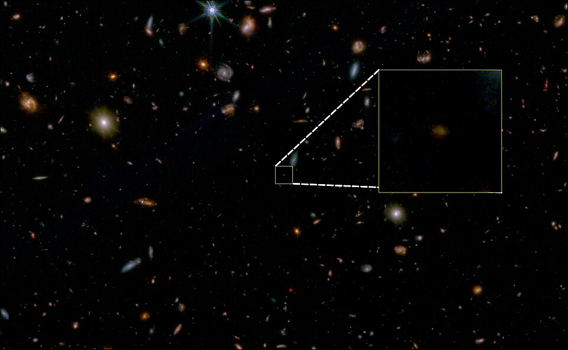

##### Description

This is an ongoing project completed as a master's thesis in collaboration with the [Cosmic Dawn Center](https://cosmicdawn.dk) at the University of Copenhagen.

Supervisors: 
- Dr. Minju Lee (DTU Space, Cosmic Dawn Centre)
- Dr. William M. Baker (Niels Bohr Institute, Cosmic Dawn Centre)
- Prof. Sune Toft (Niels Bohr Institute, Cosmic Dawn Centre)

As this project is still progressing, please keep an eye out for updates, or <a href="mailto:mbeyerstjerne@gmail.com">contact me</a> for further information.

---

##### Abstract

<figure style="width:100%; margin:0 auto;">
    
    <figcaption style="text-align:center; font-weight:normal">JWST image of JADES-GS-z7-01-QU, the oldest "dead" galaxy discovered thus far (as of 6 March 2024), with an inset to show the galaxy itself.</figcaption>
</figure>

In studying the evolution of galaxies, we observe a clear bimodality in both their morphology and colour space, discerning two distinct populations: blue, star-forming galaxies with a younger, UV-bright stellar population, and red, early-type galaxies, whose star formation has halted---so-called <i>quiescent</i> galaxies. Understanding the halting of star formation (termed <i>quenching</i>) is therefore vital for building an overall picture of galaxy evolution. 

Furthermore, recent observations using the James Webb Space Telescope have extended the discovery frontier of quenched, "red-and-dead" galaxies to much earlier in cosmic time than expected, back to when the Universe was less than 700 million years old. This breakthrough offers a timely opportunity to investigate what governs quenching at high redshift, and how it differs from quenching in the present-day universe. 

This work focus on examining the dust and gas properties of high-redshift quenched galaxies, with the goal of understanding the impact of associated feedback mechanisms---such as those from active galactic nuclei (AGN)---on the interstellar medium. We utilise ALMA continuum data to examine dust retention in quiescent systems, and JWST/NIRSpec spectroscopy to characterise AGN activity through emission line diagnostics. By studying this quiescent population, we aim to shed light on the mechanisms that drive quenching, and contribute to our understanding of how galaxies are born, live, and die.

---

##### Highlight: My first talk! 

In March 2026, I was selected to present the results of my thesis work so far at the <a href=https://indico.nbi.ku.dk/event/2264/>5th Annual Niels Bohr Institute MSc. Student Symposium</a>.

- [Poster](msc-symposium-poster.pdf)
- [Seminar slides](msc-symposium-presentation.pdf)

---