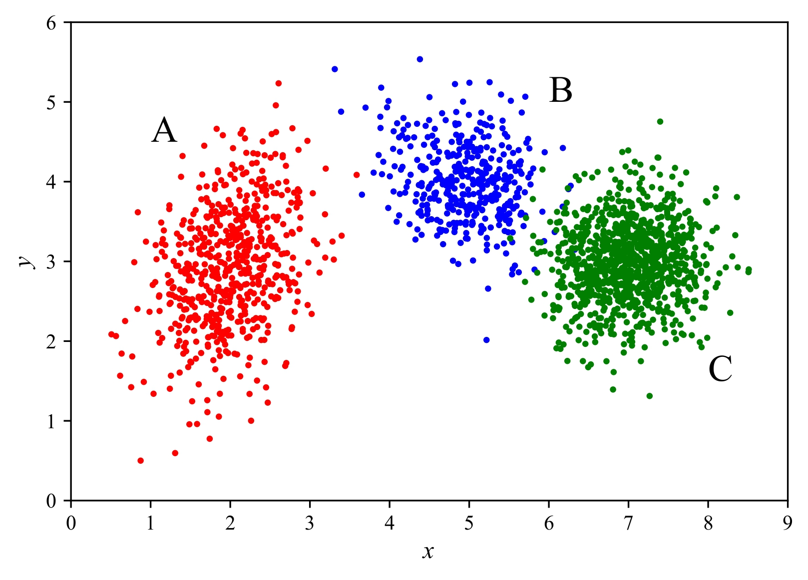

---

##### Project description

<span style="font-size:90%">This project explores Gaussian mixture models, discussing their effectiveness in detecting clusters in synthetic clustered data, and applying them to exoplanet parameter data taken from the [NASA Exoplanet Archive](https://exoplanetarchive.ipac.caltech.edu/). This was completed as the final project for the course [Advanced Methods in Applied Statistics](https://kurser.ku.dk/course/nfyk15002u), run by Dr. Jason Koskinen (KU) between February and April of 2025. </span>

---

##### Abstract

<div style="font-size:85%">
In applied statistics and machine learning, clustering methods 
are used to group together data points based on the similarity 
of their features. Gaussian mixture models (GMMs) offer an effective, 
unsupervised approach for identifying structure in multi-dimensional 
datasets, making them a valuable tool in exoplanet research where 
the true data distribution is often unknown. We begin by outlining 
the mathematical framework of GMMs and testing their effectiveness 
on synthetic data, where they successfully recover known clusters. 
When applied to exoplanet period-radius data, we observe clear 
clustering patterns. However, a two-dimensional Kolmogorov-Smirnov 
test shows that these clusters do not fully align with a Gaussian 
mixture, indicating a more complex underlying distribution. Despite 
this, the GMM provides a meaningful partitioning of the data, 
revealing structures of interest within the exoplanet population.

```
{
  "firstName": "John",
  "lastName": "Smith",
  "age": 25
}
```

</div>

---

##### Introduction to GMMs

<div style="font-size:85%">
The Gaussian mixture model (GMM) is a probabilistic clustering  technique, 
used to identify a set of $K$ clusters in an $M$-dimensional parameter 
space that best represent the observed data distribution, assuming that 
each cluster consists of a multivariate Gaussian distribution. 
This technique is categorized as an unsupervised learning method,
as clusters are identified without requiring prior information
about the data points’ classifications.
</div>

---

##### Comparing distributions with K-S testing

<div style="font-size:85%">
In order to determine whether the exoplanet data can be 
effectively describes as mixed Gaussian clusters, we need a 
method to compare the data's distribution to that of the distribution 
formed by the recovered Gaussian clusters. To do so, we make use of 
the Kolgomorov-Smirnov (K-S) test, which is a non-parametric statistical
test designed to compare a sample dataset with a reference
probability distribution (one-sample test) or to $m$ compare two
independent sample datasets (two-sample test).
It evaluates whether the distributions differ significantly by
quantifying the maximum deviation between their cumulative
distribution functions. The test in its one-dimensional formulation
is commonly used for datasets characterized by a single
variable. However, many datasets involve multi-dimensional
parameter spaces, necessitating an extension of the K-S test to
higher dimensions.
</div>

---

##### Validation on synthetic data

<div style="font-size:85%">
To test the GMM, we generate synthetic data from a two-dimensional
Gaussian mixture model with three clusters, totaling
2,000 points. Each cluster has its own mean, covariance,
and mixture weight, which represents the fraction of points
assigned to that cluster relative to the entire dataset. 

<figure style="width:80%; margin:0 auto;">
  
  <figcaption style="text-align:center; font-weight:normal"><b>Figure 1:</b> Synthetic data generated from a GMM with 3 clusters.</figcaption>
</figure>

<figure style="width:80%; margin:0 auto;">
  
  <figcaption style="text-align:center; font-weight:normal"><b>Figure 2:</b> GMM clustering of exoplanets.</figcaption>
</figure>

Applying the GMM to the synthetic data, we can display the 
1$\sigma$, 2$\sigma$, and 3$\sigma$ confidence ellipsoids
of the Gaussian components on top of the data in Figure 1.
We can see that the GMM appears to recover the three 
underlying Gaussian components of the source data. <br>

To determine the optimal number of Gaussian components,
we calculate the BIC (Bayesian Information Criterion) score 
for the fitted GMM with increasing cluster components. Uncertainties in the
BIC are estimated using 100 bootstrap trials, with resampling
from the synthetic data distribution. We see that the lowest
BIC is reached for a GMM fitted with $k$ = 3 clusters, with no
significant improvement observed beyond this. 

<figure style="width:80%; margin:0 auto;">
  
  <figcaption style="text-align:center; font-weight:normal"><b>Figure 3:</b> BIC score with increasing cluster.</figcaption>
</figure>

We conclude that the data is best described by three clusters, as anticipated.
Table 1 presents the source parameters of the Gaussian
data, along with the fitted GMM parameters and their 1𝜎
confidence intervals derived from 100 bootstrap trials. All of
the source parameters fall within the confidence intervals of the
fitted GMM parameters, confirming that the GMM accurately
recovers the underlying Gaussian components.
To assess whether the data follows a multivariate Gaussian
distribution, we apply the 2D K-S test using the Python package
[ndtest](https://github.com/syrte/ndtest). We conduct a bootstrap analysis with 200 trials,
resampling data from the fitted GMMs and calculating the
𝑝-values for each sample. Figure 5 shows the resulting uniform
distribution of 𝑝-values between 0 and 1, which supports the
null hypothesis, indicating that the data in Figure 3 is drawn
from a multivariate Gaussian distribution, as expected.
</div>

<!-- ##### Citation

Unterholzer, Detlev A., and  Moritz-Maria von Igelfeld. 2013. "Unusual Uses For Olive Oil." *Journal of Oleic Science* 34 (1): 449–489. http://www.alexandermccallsmith.com/book/unusual-uses-for-olive-oil.

```latex
@article{UI13,
author = {Detlev A. Unterholzer and Moritz-Maria von Igelfeld},
year = {2013},
title ={Unusual Uses For Olive Oil},
journal = {Journal of Oleic Science},
volume = {34},
number = {1},
pages = {449--489},
url = {http://www.alexandermccallsmith.com/book/unusual-uses-for-olive-oil}}
``` -->

<!-- --- -->

<!-- ##### Related material

+ [Presentation slides](presentation1.pdf)
+ [Summary of the paper](https://www.penguinrandomhouse.com/books/110403/unusual-uses-for-olive-oil-by-alexander-mccall-smith/) -->
